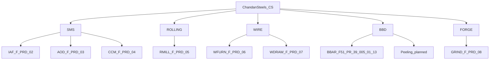

# Chandan Steel — Manufacturing Hierarchy

Canonical reference for departments, processes, log sheet templates, and run types under plant **Chandan Steels (`CS`)**.

For demo logins and URLs see [LOGINS.md](../LOGINS.md). For platform stack see [README.md](../README.md).

---

## Plant structure

```
Organisation (Chandan Steel)
└── Plant: Chandan Steels (CS)
    ├── SMS       — Steel Melting Shop
    ├── ROLLING   — Rolling Mill
    ├── WIRE      — Wire Division
    ├── BBD       — Bright Bar Division
    └── FORGE     — Forge Shop
```

---

## Hierarchy diagram



---

## Department / process / template matrix

| Dept code | Department | Process code | Process name | Template (doc no) | Template name | Run type | Status |
|-----------|------------|--------------|--------------|-------------------|---------------|----------|--------|
| `SMS` | Steel Melting Shop | `IAF` | Induction Furnace | F/PRD/02 | Furnace Log Sheet | heat | Seeded |
| `SMS` | Steel Melting Shop | `AOD` | AOD | F/PRD/03 | AOD Log Sheet | ladle_metallurgy | Seeded |
| `SMS` | Steel Melting Shop | `CCM` | Continuous Casting | F/PRD/04 | Concast Log Sheet | cast | Seeded |
| `ROLLING` | Rolling Mill | `RMILL` | Hot Rolling | F/PRD/05 | Rolling Mill Shift Production Report | shift | Seeded |
| `WIRE` | Wire Division | `WFURN` | Furnace Production | F/PRD/06 | Furnace Production Record Book | shift | Seeded |
| `WIRE` | Wire Division | `WDRAW` | Wire Drawing / Wet Drawing | F/PRD/07 | Wire Drawing Production Record Book | shift | Seeded |
| `BBD` | Bright Bar Division | `BBAR` | Bright Bar Production | F51 PR 39/005/01-13 | Bright Bar Production Register | daily | Seeded |
| `BBD` | Bright Bar Division | `PEEL` | Peeling | TBD | Peeling Machine Daily Report | TBD | Planned |
| `FORGE` | Forge Shop | `GRIND` | Grinding | F/PRD/08 | Grinding Material Details (Work Centre Wise) | daily | Planned |

**Run type notes**

| Run type | Launcher | Typical use |
|----------|----------|-------------|
| `heat` | Shift dashboard | Single heat lifecycle (IAF) |
| `ladle_metallurgy` | Shift dashboard | AOD vessel run |
| `cast` | Shift dashboard | Concast shift log |
| `shift` | Shift dashboard | Shift-bound production report (rolling, wire) |
| `daily` | Shift dashboard (no shift picker) | Date-based register; rows added through the day |

---

## Department descriptions

### SMS — Steel Melting Shop

Melting, refining, and casting. Process-parameter logs with chemistry, temperatures, and furnace data.

### Rolling Mill

Hot rolling production, delays, and hourly KPIs.

### Wire Division

Coil lifecycle: annealing furnace → wire drawing. Material transformation tracked via `coils` master (`coil_ref`).

### Bright Bar Division

Finished-goods and downstream bar processing.

- **BBAR (seeded):** production output register — customer, heat, grade, weights.
- **Peeling (planned):** not yet digitized.

Grinding does **not** belong under Bright Bar Division.

### Forge Shop

Post-forging and finishing on forged products: grinding, dimensional correction, and preparation of finished forged components.

- **GRIND (planned):** Grinding Material Details — work-centre-wise daily register for excess material removal and finishing operations on forged products.

---

## Domain model (MOI platform)

```
Organisation → Plant → Department → Process → ProcessInstance → Template → TemplateVersion → ProcessRun
```

Supporting masters shared across departments:

| Master | Used by |
|--------|---------|
| `steel_grades` | grade_ref columns |
| SMS heat runs (`heat_ref` / heat lookup) | Rolling, Wire, Bright Bar, Forge grinding rows |
| `coils` | Wire Division coil_ref traceability |
| `customers` | Bright Bar BBAR customer_ref |
| `users` | USER_REF, SIGNATURE, approvals |

---

## Template F/PRD/08 — Grinding Material Details (planned)

**Process:** `GRIND` under `FORGE`  
**Launch mode:** `daily` (DAILY_REGISTER)  
**Register No:** `ProcessRun.run_number` (same pattern as BBAR)

### Sections

| # | Section key | `section_type` | Content |
|---|-------------|----------------|---------|
| 1 | `register_header` | `fields` | `work_centre`, `date` (required) |
| 2 | `grinding_jobs` | `production_register_table` | row columns below |
| 3 | `approvals` | `fields` | `supervisor` (USER_REF), `approved_by` (SIGNATURE) |

### Row columns (`grinding_jobs`)

| Key | Label | Cell type |
|-----|-------|-----------|
| `shift` | Shift | dropdown A / B / C |
| `product` | Product | text |
| `size` | Size (MM/Inches) | text |
| `grade_id` | Grade | grade_ref |
| `heat_no` | Heat Number | heat_ref |
| `length` | Length (MTR/FT) | text |
| `pcs` | PCS | integer |
| `quantity_kg` | Quantity (KGS) | number |
| `men_power` | Men Power | integer |
| `contractor_name` | Contractor Name | text |
| `remark` | Remarks | textarea |

Sr No uses the existing row index in the production register table UI.

**Workflow:** `created → in_progress → completed → approved → closed` (6-state; no shift binding).

---

## Navigation mapping (target)

| Surface | Mapping |
|---------|---------|
| Shift Dashboard | `GRIND` — daily register; hide shift/grade pickers |
| Admin Departments | `GRIND → F/PRD/08` |
| Run Report | `F/PRD/08 → GrindingMaterialReport` (when implemented) |

---

## Seed data (implementation spec)

### Department

Add to `seed_divisions.py`: `("FORGE", "Forge Shop")`

### Process / template seed (future `seed_forge_grinding.py`)

- Idempotent on `doc_no == "F/PRD/08"`
- Process `GRIND`, asset group `grinding_work_centres`, asset `GR-01`
- Template sections as defined above

### Demo users (future `seed_org_roles.py`)

| Role | Email | Password |
|------|-------|----------|
| HoD | `hod.forge@chandansteel.com` | `hod123` |
| Supervisor | `supervisor.forge@chandansteel.com` | `forge123` |
| Worker | `worker.forge@chandansteel.com` | `forge123` |

---

## Permission model

| Role | Forge Shop scope |
|------|------------------|
| CEO | All departments |
| HoD (`FORGE`) | All processes in Forge Shop |
| Supervisor (`GRIND`) | Approve/close GRIND daily registers |
| Worker | Create and edit rows on own daily register |

Rules match existing department scoping elsewhere in the platform.
