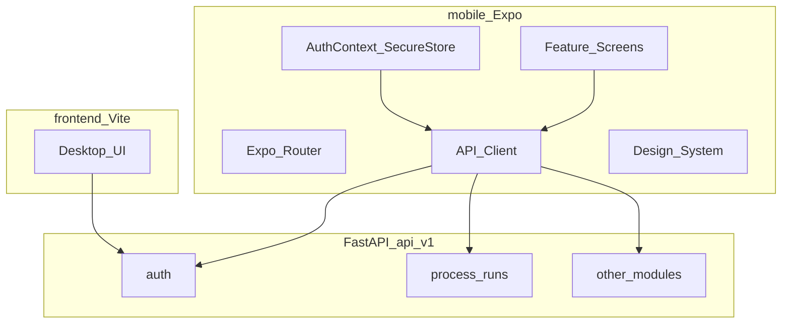

# MOI Mobile App — Master Build Plan (Expo / React Native)

**Version:** 2.0 (detail expansion)  
**Status:** Source of truth for full-parity mobile  
**How to build:** Send the agent exactly one `BUILD CHUNK <ID>` at a time. Never “implement the whole plan.”

---

## Locked product decisions

| Item | Decision |
|------|----------|
| Stack | **Expo SDK 54** (React Native) + TypeScript + Expo Router — matches Play Store Expo Go. (SDK 57 not on stores yet.) |
| Backend | Existing FastAPI `/api/v1` — no schema rewrite for mobile |
| Web | Keep `frontend/` for desktop density; mobile is **new** `mobile/` package |
| Log entry | Chronological **cards** with **full cell parity** (no stubs, no DesktopOnlyGate) |
| Quality | Same capabilities as web for every role and department |
| Auth storage | `expo-secure-store` for JWT |
| API env | `EXPO_PUBLIC_API_URL` (HTTPS in prod; LAN IP for device testing) |

---

## Document map

| Part | Contents |
|------|----------|
| **A** | Vision, quality bar, architecture, design system |
| **B** | Plan 1 — Expo foundation (`P1-*`) — **start here** |
| **C** | Shared log-sheet engine + cell editors (`P2-ENGINE-*`) |
| **D** | Manufacturing depts — every section & field (`P2-*`) |
| **E** | All other modules (`P3`–`P5`) |
| **F** | Plans 2–6 sequence + chunk index |
| **G** | API quick reference |

---

# Part A — Vision, quality, architecture

## A.1 Goals

1. Installable Android app (Expo Go during build; EAS APK later). iOS when needed.
2. Same JWT auth as web (`POST /auth/login`, `GET /auth/me`, `PATCH /auth/me`).
3. Role home + nav matching web `App.tsx` / `Sidebar.tsx`.
4. **Full** access to every module the role can use on web — mobile-native layouts, **not** feature cuts.
5. Every seeded log sheet fillable end-to-end with every field/column type.

## A.2 Non-goals

- Rewriting PostgreSQL / FastAPI domain model for Plan 1.
- Deleting the Vite web app.
- Implementing all screens inside Plan 1 (foundation only).
- “Lite mode” or “open on desktop” gates in the Expo app.

## A.3 Quality bar (non-negotiable)

| Rule | Meaning |
|------|---------|
| Q1 | No `DesktopOnlyGate` in `mobile/` |
| Q2 | No JSON-string stubs for complex cells — native editors |
| Q3 | Same PATCH payloads as web so reports/finance keep working |
| Q4 | Same role gates as web |
| Q5 | Touch targets ≥ 48dp; body text ≥ 16sp where users type |
| Q6 | Safe-area respected; keyboard never hides primary Save/Next |
| Q7 | Loading / empty / error states on every list & form |
| Q8 | Offline banner; failed saves show retry, never silent fail |
| Q9 | Each chunk ships with **Acceptance** checklist — all must pass |
| Q10 | Prefer porting types/API shapes from `frontend/src` — do not invent fields |

## A.4 Architecture



**Target tree**

```text
Log_Project/
  backend/
  frontend/
  mobile/
    app/
      _layout.tsx
      index.tsx
      login.tsx
      (app)/
        _layout.tsx          # drawer
        home.tsx
        profile.tsx
        messages/...
        shift/...
        heat/[runId].tsx
        ...
    src/
      api/                   # one file per domain (port from frontend/src/api)
      auth/AuthContext.tsx
      components/ui/
      components/run-wizard/
      hooks/
      theme/
      types/
      utils/roles.ts
    app.json
    package.json
    eas.json                 # Plan 6
  docs/MOBILE_APP_MASTER_PLAN.md
```

## A.5 Design system (apply from Plan 1)

| Token | Spec |
|-------|------|
| Brand | Align with web `brand-600` ≈ `#2563EB` |
| Background | `#F8FAFC` screens; white cards |
| Radius | Cards 16; inputs 12; buttons 12 |
| Spacing | 8-pt grid; screen padding 16 |
| Button.lg | minHeight 48, full-width in sticky footers |
| ListRow | minHeight 56, chevron, subtitle |
| StickyFooter | absolute/safe bottom; Save + Next + optional workflow |
| Typography | Title 22/700; section 17/600; body 16/400; caption 13 |

**Required UI primitives (chunk `P1-06`):** `Button`, `TextField`, `SelectSheet`, `DateTimeField`, `Card`, `Badge`, `ListRow`, `EmptyState`, `LoadingView`, `ErrorBanner`, `StickyFooter`, `Screen`, `SegmentedTabs`.

## A.6 Testing matrix (every chunk)

| Device | Must verify |
|--------|-------------|
| Android emulator | Happy path |
| Physical Android phone | Keyboard, safe area, network |
| Slow 3G / airplane toggle | Errors + offline banner |
| Role smoke | At least one user of the roles that use the screen |

---

# Part B — Plan 1: Expo foundation

## BUILD CHUNK `P1-00` — Prerequisites

**Status: COMPLETE**

**Do**
- [x] Node 20+ (v20.15.1)
- [x] Android path: Expo Go on phone (emulator optional)
- [x] Backend up on `0.0.0.0:8000`; LAN IP for phone (`scripts/print-lan-ip.ps1`)
- [x] CORS includes Expo local ports
- [x] Confirm logins in `LOGINS.md` (admin login smoke OK)

**Doc:** [`docs/MOBILE_P1_00_PREREQUISITES.md`](./MOBILE_P1_00_PREREQUISITES.md)

**Acceptance:** Backend `/docs` → **200**; `/health` ok; Expo Go installed.

**EAS note:** Project id `371731a7-c9e4-4569-bc23-6161696bd8f1` — link inside `mobile/` during/after `P1-01`. App folder name = `mobile/` (not a separate Desktop `chandan-steel-app`). Skip `eas build` until a custom dev client is needed; Expo Go + `npx expo start` is enough for Plan 1.

---

## BUILD CHUNK `P1-01` — Scaffold `mobile/`

**Status: COMPLETE**

**Do**
```bash
cd Log_Project
npx create-expo-app@latest mobile --template tabs
```
Convert to Expo Router stacks + drawer as needed.

**Create/adjust**
| File | Responsibility |
|------|----------------|
| `mobile/app/_layout.tsx` | Providers |
| `mobile/app/index.tsx` | Auth gate → role home |
| `mobile/app/login.tsx` | Login (wire in P1-03) |
| `mobile/app/(app)/_layout.tsx` | Authenticated drawer |
| `mobile/app.json` | name `MOI`, slug, orientation `default`, package `com.chandan.moi` |
| `mobile/README.md` | How to run + env |

**Acceptance:** `npx expo start` opens app shell without crash. ✅ (scaffold verified)

---

## BUILD CHUNK `P1-02` — API client + SecureStore

**Port from:** `frontend/src/api/client.ts`, `auth.ts`

| Concern | Spec |
|---------|------|
| Base URL | `process.env.EXPO_PUBLIC_API_URL` |
| Header | `Authorization: Bearer <token>` |
| Token | `SecureStore` key `moi_access_token` |
| User | `SecureStore` key `moi_user` (JSON) |
| 401 | Clear store → `router.replace('/login')` |
| Timeout | 30s; show friendly error |

**Methods required now**
- `POST /auth/login`
- `GET /auth/me`

**Acceptance:** Login persists across app kill; logout clears SecureStore.

---

## BUILD CHUNK `P1-03` — Login screen

**UI**
- Email, password (show/hide), Submit lg
- KeyboardAvoidingView
- Error banner under form
- Optional “Demo hint” only in `__DEV__`

**Acceptance:** Every demo role in `LOGINS.md` can sign in on a physical phone.

---

## BUILD CHUNK `P1-04` — Role home redirect

Mirror web:

| Role | Home route |
|------|------------|
| `super_admin`, `admin` | `/(app)/admin` |
| CEO tier | `/(app)/pulse/plant` |
| `hr` | `/(app)/workforce` |
| `hod`, `plant_admin` | `/(app)/pulse/department` |
| `maintenance` | `/(app)/maintenance` |
| `supervisor`, `department` | `/(app)/supervisor` |
| `worker`, `member` | `/(app)/shift` |
| else | `/(app)/shift` |

**Acceptance:** Login as each role → correct home.

---

## BUILD CHUNK `P1-05` — Drawer navigation

**Always:** Profile, Messages (badge later).

**Conditional sections** — copy visibility from `frontend/src/components/layout/Sidebar.tsx` (admin, pulse, HOD, supervisor, maintenance, shop floor, workforce, foundation, finance).

**Placeholder screens:** Title + description + **next chunk ID** from this doc (so nothing is forgotten).

**Acceptance:** Worker vs admin menus differ correctly; Sign out works.

---

## BUILD CHUNK `P1-06` — Design system components

Implement primitives in A.5 with Storybook optional; must be used on Login + Profile + one list.

**Acceptance:** Lint-clean; Login uses `TextField` + `Button.lg`.

---

## BUILD CHUNK `P1-07` — Profile

**API:** `GET/PATCH /auth/me`  
**Fields:** Match web `ProfilePage` (name, etc.).

**Acceptance:** Load + save profile on device.

---

## BUILD CHUNK `P1-08` — Plan 1 exit gate

- [ ] Emulator + physical phone
- [ ] Session restore
- [ ] Role homes
- [ ] Drawer correctness
- [ ] Env-based API URL
- [ ] `mobile/README.md` complete

**Plan 1 complete → start `P2-ENGINE-01`.**

---

# Part C — Shared log-sheet engine

## C.1 Field-type → mobile control map

| field_type / column type | Mobile control | Notes |
|--------------------------|----------------|-------|
| `text` / `textarea` | TextField / multiline | |
| `number` / `integer` | TextField `decimal-pad` / `number-pad` | |
| `date` | Date picker sheet | |
| `time` | Time picker | |
| `datetime` | DateTime picker + **Now** if `quick_action: now` | |
| `dropdown` | `SelectSheet` with options | |
| `grade_ref` | SelectSheet from `/steel-grades` | |
| `user_ref` | SelectSheet from plant users | Default current user when empty |
| `signature` | TextField “type full name” (match web) | |
| `calculated` | Read-only computed | Recompute client-side like web formulas |
| `asset_ref` | Asset picker filtered by `asset_group` | |
| `material_ref` | Material catalog select | scrap vs alloy by section |
| `heat_ref` | Typeahead → `/process-runs/heat-lookup` | |
| `coil_ref` | Typeahead → `/coils` / lookup | |
| `customer_ref` | SelectSheet → `/customers` | |
| `time_range` | Bottom sheet: start, end, auto total minutes | |
| `strand_pair` | Two fields strand_1 / strand_2 (respect subtype) | |
| `zone_strand` | Zone × strand nested editors | |
| `mould_tube` | Per-strand no + life | |
| `ladle_temp` | before_purging / after_purging | |
| `furnace_zones` | heat_zone_1/2, soak_zone_1/2 | |
| `object` + `fields[]` | Nested labeled fields from config | |

## BUILD CHUNK `P2-ENGINE-01` — Run host

**Route:** `/(app)/heat/[runId]`

**APIs**
| Action | Call |
|--------|------|
| Load | `GET /process-runs/{id}` |
| Template | `GET /templates/versions/{template_version_id}` |
| Save fields | `PATCH` `{ field_values: [{field_key,value}] }` |
| Save section | `PATCH` `{ section_data: [{section_key,data}] }` |
| Transition | `POST /process-runs/{id}/transitions` `{ to_state }` |
| Events | `GET /process-runs/{id}/events` |
| Remarks | GET/POST remarks + attachments |

**UX:** Progress bar, step title, StickyFooter Back|Save|Next, workflow CTAs on owning step, Wake Lock while open.

**Acceptance:** Open any existing run; Save fields round-trips; pull-to-refresh reloads.

## BUILD CHUNK `P2-ENGINE-02` — `buildCardSteps`

Port logic from `frontend/src/components/run-wizard/buildCardSteps.ts` — expand sections into chronological steps (list + row/sample/hour cards).

**Acceptance:** Unit-testable pure function; IAF yields expected step count for empty chemistry (list + ≥1 sample).

## BUILD CHUNK `P2-ENGINE-03` — Adapters for every `section_type`

Implement RN bodies for: `fields`, chemistry `table`, `repeatable_group`, `static_material_table`, `matrix_table`, `target_chemistry`, `sample_chemistry_matrix`, `production_log_table`, `production_register_table`, `delay_register_table`, `hourly_production_matrix`, remarks thread.

**Acceptance:** Each adapter has a fixture render without crash; complex cells use Part C.1 editors.

## BUILD CHUNK `P2-ENGINE-04` — Shift launcher

Port `ShiftDashboard` process list:

`IAF`, `AOD`, `CCM`, `RMILL`, `WFURN`, `WDRAW`, `BBAR`, `GRIND`

**APIs:** plants, processes, instances, shifts, grades, `POST /process-instances/{id}/runs`, active runs, previous handover.

**Acceptance:** Start IAF + daily BBAR (no shift) + shift RMILL from phone.

---

# Part D — Manufacturing departments (full section specs)

## D.1 SMS — Steel Melting Shop

### D.1.1 IAF — F/PRD/02 — `heat` — CHUNK `P2-SMS-IAF`

**Detection:** section keys include `heat_info` + `charge_mix`.

#### Sections & fields

**0 `heat_info` (fields)**

| name | label | type | req |
|------|-------|------|-----|
| date | Date | date | Y |
| heat_no | Heat No. | text | Y |
| grade | Grade | grade_ref | Y |
| shift | Shift | dropdown A/B/C | Y |
| melter | Name of Melter | user_ref | Y |

**1 `timing_equipment` (fields)**

| name | label | type | req | notes |
|------|-------|------|-----|-------|
| previous_heat_tapping_time | Previous Heat Tapping Time | datetime | | |
| crucible | Crucible No / Life | asset_ref | | group crucibles |
| power_on_time | Power On Time | datetime | Y | Now |
| tapping_time | Tapping Time | datetime | Y | Now |
| process_time | Process Time | calculated | | tapping − power_on |
| tap_to_tap_time | Tap To Tap Time | calculated | | tapping − previous |
| transfer_ladle | Transfer Ladle No / Life | asset_ref | | ladles |

**2 `chemistry` (table)** — config `max_samples=8`, rows from grade elements; samples list + per-sample element cards.

**3 `ferro_alloys` / 4 `charge_mix` (repeatable_group)** — rows: `material` (material_ref), `quantity_kg` (number). Alloys vs scrap catalogs.

**5 `electrical_power` (fields)** — final_voltage, final_frequency, power_initial, power_final, power_total (calculated).

**6 `furnace_status` (fields)** — condition dropdown (Normal / Minor Issue / Needs Attention), condition_notes textarea.

**7 `remarks_signoff` (fields)** — remarks (+ RemarkThread), melter_signoff (req), jr_melter_signoff.

#### Workflow (IAF)

| Transition | Tab / card owner | Hint |
|------------|------------------|------|
| created→in_progress | heat_info | Confirm heat info, start heat |
| in_progress→waiting_for_sample | timing_equipment | Record power-on, power on furnace |
| waiting_for_sample→refining | chemistry | Enter sample chemistry |
| refining→refining | chemistry | Add another sample |
| refining→ready_to_tap | ferro_alloys | Complete ferro alloys |
| ready_to_tap→completed | timing_equipment | Tapping time + power readings |
| completed→approved | remarks_signoff | Sign-off then approve |
| approved→closed | remarks_signoff | Close when review done |
| in_progress→aborted | heat_info | Abort |

**Stepper labels:** Start → Power on → Sample → Refining → Ready to tap → Tapped → Approved → Closed

**Acceptance:** Full heat lifecycle on phone; all sections save; workflow buttons only on owning cards; chemistry supports multiple samples.

---

### D.1.2 AOD — F/PRD/03 — `ladle_metallurgy` — CHUNK `P2-SMS-AOD`

| # | key | type | Mobile |
|---|-----|------|--------|
| 0 | heat_info | fields | date, shift, heat_no, grade, billet_size |
| 1 | equipment_info | fields | vessel (req), casting_ladle, transfer_ladle, if_tapping_time, lm_pouring_time |
| 2 | personnel | fields | 5× user_ref |
| 3 | weight_info | fields | weights + ladle asset |
| 4 | alloy_additions | static_material | FE_CR, FE_MN, FE_SI, FE_MO, FE_NI, P_NI, TI |
| 5 | flux_additions | static_material | 304_SCRAP, FE_NI, LIME, DOLOMITE, CPC, OTHER |
| 6 | blow_process | matrix | Rows: De-Si,1–5,VCD,RED,Slag off × 16 columns (time, gases, lance, consumption) — **one blow = one card**, all columns |
| 7 | required_chemistry | target_chemistry | elements C,SI,MN,P,S,CR,MO,NI,CU,N2,CO,W,AL,SN,TI |
| 8 | sample_chemistry | sample_chemistry_matrix | samples I/F-Final…Final + temperature + all elements |
| 9 | time_summary | fields | ladle/heat times, calculated process time, temps, weight |
| 10 | gas_consumption | fields | o2/n2/ar/air nm3 (may auto from blow) |
| 11 | remarks | fields | textarea |
| 12 | approvals | fields | shift_incharge + hod signatures |

**Acceptance:** All 13 sections save; blow card exposes every column; sample cards include temperature.

---

### D.1.3 CCM — F/PRD/04 — `cast` — CHUNK `P2-SMS-CCM`

| # | key | type |
|---|-----|------|
| 0 | shift_header | fields: date, shift |
| 1 | casting_entries | production_log_table, default 5 rows |
| 2 | remarks | textarea |
| 3 | approvals | 2 signatures |

**`casting_entries` columns (FULL editors required)**

| key | label | type |
|-----|-------|------|
| heat_no | Heat No. | text |
| grade_id | Grade | grade_ref |
| liquidus_temp | Liquidus Temp. | number |
| section | Section | text |
| casting_powder | Casting Powder | text |
| tundish_no | Tundish No. | text |
| start_pouring | Start Pouring | datetime |
| casting_begin | Casting Begin | datetime |
| pouring_tundish | Pouring Tundish | datetime |
| ladle_temp | Ladle Temp °C | object before/after purging |
| purging_time | Purging Time | time_range |
| tundish_temp | Tundish Temp. | number |
| casting_speed | Casting Speed | strand_pair number |
| cast_start / cast_end | Cast Start/End | strand_pair datetime |
| water_flow_primary | Water Flow Primary | strand_pair number |
| delta_t | Delta T | strand_pair number |
| water_flow_secondary | Water Flow Secondary | zone_strand |
| mould_tube | Mould Tube | mould_tube |
| sen_preheating | Sen Pre-heating | time_range |
| withdrawal_pressure | Withdrawal Pressure | strand_pair number |
| billets_count | No. of Billets | integer |
| supervisor | Supervisor | text |

**Acceptance:** Add row; edit mould_tube + time_range + zone_strand on phone; save; reopen values intact.

---

### D.1.4 SMS placeholders

`LF`, `RM`, `QC`, `MAINT` processes under SMS: **no templates** — do not show in launcher until seeded.

---

## D.2 ROLLING — `RMILL` F/PRD/05 — CHUNK `P2-ROLLING-RMILL`

| # | key | type | Detail |
|---|-----|------|--------|
| 0 | shift_details | fields | date, shift, mill_section (Bar/Garret/Wire Rod), group_no |
| 1 | production_summary | fields | billets_charged, discharges, cobble/hot_out/rolled summaries |
| 2 | energy | fields | oil_consumption, power_consumption |
| 3 | personnel | fields | 7× user_ref |
| 4 | delay_register | delay_register | rows: time_from/to, lost min, delay_code_id, reason, action_taken, assigned_to, status; codes from `/delay-codes` |
| 5 | remarks | fields | |
| 6 | production_batches | production_log | time_start, heat_ref, grade_ref, charged/rolled/hot_out/cobble, section_shape dropdown, party, billet_size, furnace_zones |
| 7 | hourly_matrix | hourly | Hours I–XII × delay_minutes, cobble, hot_out, rolled, remarks |
| 8 | approvals | prepared_by signature |

**Acceptance:** Delay + batch + all 12 hour cards save.

---

## D.3 WIRE

### D.3.1 WFURN F/PRD/06 — CHUNK `P2-WIRE-WFURN`

| Section | Contents |
|---------|----------|
| shift_details | date, shift, operator |
| input_coils | work_order_no, grade_id, heat_no (heat_ref), size_mm, coil_no |
| furnace_output | coil_ref, tube_head_no, speed_m_min, weight_kg, remark |
| approvals | prepared_by, approved_by |

### D.3.2 WDRAW F/PRD/07 — CHUNK `P2-WIRE-WDRAW`

| Section | Contents |
|---------|----------|
| shift_details | date, shift, operator |
| input_material | WO, grade, heat_ref, inlet_size, inlet_coil_ref, condition dropdown |
| output_material | inlet_coil_ref, outlet_size, lubricant dropdown, finish_coil_no, weight, remark |
| approvals | prepared_by, approved_by |

**Acceptance:** Coil pickers work; drawing condition/lubricant options match seed.

---

## D.4 BBD

### D.4.1 BBAR — CHUNK `P2-BBD-BBAR`

| Section | Contents |
|---------|----------|
| register_header | date |
| production_register | r_size_mm, grade_id, final_size_mm, heat_no, coil_weight_kg, coil_count, total_weight_kg (calc), customer_id |
| approvals | approved_by |

### D.4.2 PEEL — CHUNK `P2-BBD-PEEL`

Blocked until seeded. Screen: “Peeling not digitized yet.”

---

## D.5 FORGE — GRIND F/PRD/08 — CHUNK `P2-FORGE-GRIND`

**Seeded today:** `register_header` — work_centre (req), date (req).  
**When jobs table appears:** full register row cards per hierarchy doc columns.

**Acceptance:** Header saves; if API returns more sections, engine renders them without hardcoding only header.

---

## D.6 QUAL / MAINT / UTIL

Dept shells only — no log sheets. Show in org browsers; Maintenance **module** is Part E.

---

## D.7 Reports — CHUNK `P2-REPORTS`

`/(app)/reports/[runId]` — read-only structured view; share HTML/PDF if available; deep link from My Runs / Supervisor.

---

# Part E — Non-log modules

## E.1 Operations — Plan 3

| Chunk | Screen | APIs | UX / parity |
|-------|--------|------|-------------|
| `P3-OPS-SHIFT` | Shift Dashboard | plants, processes, instances, shifts, grades, create run, active runs, handover | Full launcher + cards |
| `P3-OPS-MYRUNS` | My Runs | `GET /process-runs/mine` | Edit / Report actions |
| `P3-OPS-SUPER` | Supervisor | all runs, filters, create maintenance issue | Full issue form |
| `P3-OPS-HOD` | HOD | same ops data scoped | Full |

## E.2 Safety

| Chunk | Screen | APIs |
|-------|--------|------|
| `P3-SAFE-SCAN` | Scan | Camera + `POST /safety/scan` + asset search |
| `P3-SAFE-DASH` | Dashboard | `/safety/dashboard/{plantId}` |
| `P3-SAFE-LISTS` | Inspections/SOPs/Incidents | GET + create where web supports |

## E.3 Maintenance

| Chunk | Screen | Must include |
|-------|--------|-------------|
| `P3-MAINT-QUEUE` | Issue queue | tabs, assign, close + resolution notes |
| `P3-MAINT-DASH` | PM analytics | KPIs + charts |
| `P3-MAINT-WO-LIST` | WO list | status filters |
| `P3-MAINT-WO-EXEC` | Execution | **all** checklist items + transitions |
| `P3-MAINT-PM-LIST` | Programs | |
| `P3-MAINT-PM-WIZ` | Wizard | **all 6 steps**, full fields (Program, Triggers, Tasks, Notifications, Auto WO, Review) |

## E.4 Messages

| Chunk | Must include |
|-------|-------------|
| `P3-MSG-INBOX` | Inbox/Sent list → detail |
| `P3-MSG-ALERTS` | Notifications + deep links |
| `P3-MSG-COMPOSE` | @all, @DEPT, attachments, suggest recipients |

## E.5 Workforce — Plan 4 (full parity)

| Chunk | Screen | Notes |
|-------|--------|-------|
| `P4-WF-DASH` | Dashboard | metrics |
| `P4-WF-EMP` | Employees | all form fields from web modal |
| `P4-WF-CON` | Contractors | full CRUD |
| `P4-WF-ASSIGN` | Assignments | full |
| `P4-WF-PLAN` | Shift planning | person×day editors + publish (not removed) |
| `P4-WF-ATT` | Attendance | per-person status + contractor block |
| `P4-WF-HAND` | Handover | |
| `P4-WF-LEAVE` | Leave admin | approve/reject |
| `P4-WF-SKILL` | Skills | per-employee level editors |
| `P4-WF-TRAIN` | Training | |
| `P4-WF-PAY` | Payroll | runs + line items + process |
| `P4-WF-SAL` | Salary structures | |
| `P4-WF-MY-*` | Self-service | attendance, leave, payslips |

## E.6 Pulse / Energy / Inventory / Assets — Plan 5

| Chunk | Requirement |
|-------|-------------|
| `P5-PULSE-*` | Full plant/dept/asset pulse data |
| `P5-PULSE-WS` | **All** workspace sections: Overview, Live, Maint, Alerts, OEE, Energy, Inspections, SOP, QR |
| `P5-ENERGY` | Full energy dashboard |
| `P5-INV` | Pulse + adjust if API allows |

## E.7 Foundation

Assets CRUD, all masters tabs, observations, CAs, documents upload/download, KPI defs — chunks `P5-FND-*`.

## E.8 Finance

Plant→dept→process→asset drill-down, run cost sheet, **all** cost master tabs, **full** mapping builder, calculations, analytics — chunks `P5-FIN-*`. **No feature gates.**

## E.9 Admin / Executive

Orgs hierarchy, departments, sheets preview, activity, users CRUD, executive overview + employees — chunks `P5-ADM-*`, `P5-EXE-*`.

---

# Part F — Plan sequence & how to order work

| Plan | Chunks | Outcome |
|------|--------|---------|
| **1** | `P1-00`…`P1-08` | Expo app logs in, navigates by role |
| **2** | `P2-ENGINE-*` + all `P2-SMS|ROLLING|WIRE|BBD|FORGE-*` + `P2-REPORTS` | Every seeded log sheet on phone |
| **3** | `P3-*` | Floor ops, safety, maintenance, messages |
| **4** | `P4-WF-*` | Full workforce |
| **5** | `P5-*` | Pulse, foundation, finance, admin |
| **6** | Hardening | EAS APK, offline drafts, push optional, device QA |

### Order text for the agent

```text
Implement BUILD CHUNK <ID> from docs/MOBILE_APP_MASTER_PLAN.md
Full feature parity. No desktop-only gates. Follow Acceptance in that chunk.
```

**Start:** `Implement BUILD CHUNK P1-02 from docs/MOBILE_APP_MASTER_PLAN.md`

---

# Part G — API quick reference (mobile)

Base: `EXPO_PUBLIC_API_URL` → `/api/v1`

| Domain | Key paths |
|--------|-----------|
| Auth | `POST /auth/login`, `GET|PATCH /auth/me` |
| Runs | `GET /process-runs`, `/mine`, `/{id}`; `PATCH /{id}`; `POST /{id}/transitions`; remarks + attachments |
| Create run | `POST /process-instances/{id}/runs` |
| Templates | `GET /templates/versions/{id}` |
| Maintenance | `/maintenance/issues/*`, `/maintenance/pm/*` |
| Workforce | `/workforce/*`, `/workforce/ops/*`, `/workforce/payroll/*`, `/workforce/leave/*` |
| Messages | `/messages/*`, `/notifications/*` |
| Pulse/Safety | `/pulse/*`, `/assets/{id}/workspace`, `POST /safety/scan` |
| Foundation | `/foundation/*`, `/masters/*` |
| Finance | `/finance/*` |
| Lookups | plants, processes, instances, shifts, steel-grades, materials, coils, customers, delay-codes, users |

---

# Chunk index

**Plan 1:** `P1-00` `P1-01` `P1-02` `P1-03` `P1-04` `P1-05` `P1-06` `P1-07` `P1-08`

**Plan 2:** `P2-ENGINE-01` `P2-ENGINE-02` `P2-ENGINE-03` `P2-ENGINE-04` · `P2-SMS-IAF` `P2-SMS-AOD` `P2-SMS-CCM` · `P2-ROLLING-RMILL` · `P2-WIRE-WFURN` `P2-WIRE-WDRAW` · `P2-BBD-BBAR` `P2-BBD-PEEL` · `P2-FORGE-GRIND` · `P2-REPORTS`

**Plan 3:** `P3-OPS-SHIFT` `P3-OPS-MYRUNS` `P3-OPS-SUPER` `P3-OPS-HOD` · `P3-SAFE-SCAN` `P3-SAFE-DASH` `P3-SAFE-LISTS` · `P3-MAINT-QUEUE` `P3-MAINT-DASH` `P3-MAINT-WO-LIST` `P3-MAINT-WO-EXEC` `P3-MAINT-PM-LIST` `P3-MAINT-PM-WIZ` · `P3-MSG-INBOX` `P3-MSG-ALERTS` `P3-MSG-COMPOSE`

**Plan 4:** `P4-WF-DASH` `P4-WF-EMP` `P4-WF-CON` `P4-WF-ASSIGN` `P4-WF-PLAN` `P4-WF-ATT` `P4-WF-HAND` `P4-WF-LEAVE` `P4-WF-SKILL` `P4-WF-TRAIN` `P4-WF-PAY` `P4-WF-SAL` `P4-WF-MY-ATT` `P4-WF-MY-LEAVE` `P4-WF-MY-PAY`

**Plan 5:** `P5-PULSE-PLANT` `P5-PULSE-DEPT` `P5-PULSE-ASSET` `P5-PULSE-WS` `P5-ENERGY` `P5-INV` · `P5-FND-ASSETS` `P5-FND-MASTERS` `P5-FND-OBS` `P5-FND-CA` `P5-FND-DOCS` `P5-FND-AN` · `P5-FIN-DASH` `P5-FIN-SHEET` `P5-FIN-MASTERS` `P5-FIN-MAP` `P5-FIN-CALC` `P5-FIN-AN` · `P5-ADM-HOME` `P5-ADM-ORG` `P5-ADM-DEPT` `P5-ADM-SHEETS` `P5-ADM-ACT` `P5-ADM-USERS` · `P5-EXE-HOME` `P5-EXE-EMP`

---

*End of master plan v2.0. Feed one BUILD CHUNK at a time for top-notch implementation.*
