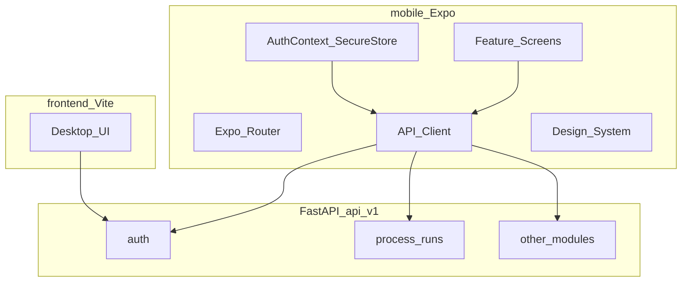

# MOI Mobile App — Master Build Plan (Expo / React Native)

**Version:** 2.2 (Parts D–F production-depth; Plan 5 Energy→Exec thickened to Plan-4 quality)  
**Status:** Source of truth for full-parity mobile  
**How to build:** Send the agent exactly one `BUILD CHUNK <ID>` at a time. Never “implement the whole plan.”  
**Spec rule:** Every chunk in Parts D–F has **Acceptance**. If Acceptance is missing, expand the chunk before coding (Q9).

---

## Locked product decisions

| Item | Decision |
|------|----------|
| Stack | **Expo SDK 54** (React Native) + TypeScript + Expo Router — matches Play Store Expo Go. (SDK 57 not on stores yet.) |
| Backend | Existing FastAPI `/api/v1` — no schema rewrite for mobile |
| Web | Keep `frontend/` for desktop density; mobile is **new** `mobile/` package |
| Log entry | Chronological **cards** with **full cell parity** (no stubs, no DesktopOnlyGate) |
| Quality | Same capabilities as web for every role and department |
| Auth storage | `expo-secure-store` for JWT |
| API env | `EXPO_PUBLIC_API_URL` (HTTPS in prod; LAN IP for device testing) |

---

## Document map

| Part | Contents |
|------|----------|
| **A** | Vision, quality bar, architecture, design system |
| **B** | Plan 1 — Expo foundation (`P1-*`) — **start here** |
| **C** | Shared log-sheet engine + cell editors (`P2-ENGINE-*`) |
| **D** | Manufacturing depts — section/field specs + remaining `P2-*` |
| **E** | Ops / Safety / Maint / Messages / Workforce / Pulse / Foundation / Finance / Admin (`P3`–`P5`) — full BUILD CHUNKs |
| **F** | Plan sequence, exit gates, Plan 6 hardening, chunk index |
| **G** | API quick reference |

---

# Part A — Vision, quality, architecture

## A.1 Goals

1. Installable Android app (Expo Go during build; EAS APK later). iOS when needed.
2. Same JWT auth as web (`POST /auth/login`, `GET /auth/me`, `PATCH /auth/me`).
3. Role home + nav matching web `App.tsx` / `Sidebar.tsx`.
4. **Full** access to every module the role can use on web — mobile-native layouts, **not** feature cuts.
5. Every seeded log sheet fillable end-to-end with every field/column type.

## A.2 Non-goals

- Rewriting PostgreSQL / FastAPI domain model for Plan 1.
- Deleting the Vite web app.
- Implementing all screens inside Plan 1 (foundation only).
- “Lite mode” or “open on desktop” gates in the Expo app.

## A.3 Quality bar (non-negotiable)

| Rule | Meaning |
|------|---------|
| Q1 | No `DesktopOnlyGate` in `mobile/` |
| Q2 | No JSON-string stubs for complex cells — native editors |
| Q3 | Same PATCH payloads as web so reports/finance keep working |
| Q4 | Same role gates as web |
| Q5 | Touch targets ≥ 48dp; body text ≥ 16sp where users type |
| Q6 | Safe-area respected; keyboard never hides primary Save/Next |
| Q7 | Loading / empty / error states on every list & form |
| Q8 | Offline banner; failed saves show retry, never silent fail |
| Q9 | Each chunk ships with **Acceptance** checklist — all must pass |
| Q10 | Prefer porting types/API shapes from `frontend/src` — do not invent fields |

## A.4 Architecture



**Target tree**

```text
Log_Project/
  backend/
  frontend/
  mobile/
    app/
      _layout.tsx
      index.tsx
      login.tsx
      (app)/
        _layout.tsx          # drawer
        home.tsx
        profile.tsx
        messages/...
        shift/...
        heat/[runId].tsx
        ...
    src/
      api/                   # one file per domain (port from frontend/src/api)
      auth/AuthContext.tsx
      components/ui/
      components/run-wizard/
      hooks/
      theme/
      types/
      utils/roles.ts
    app.json
    package.json
    eas.json                 # Plan 6
  docs/MOBILE_APP_MASTER_PLAN.md
```

## A.5 Design system (apply from Plan 1)

| Token | Spec |
|-------|------|
| Brand | Align with web `brand-600` ≈ `#2563EB` |
| Background | `#F8FAFC` screens; white cards |
| Radius | Cards 16; inputs 12; buttons 12 |
| Spacing | 8-pt grid; screen padding 16 |
| Button.lg | minHeight 48, full-width in sticky footers |
| ListRow | minHeight 56, chevron, subtitle |
| StickyFooter | absolute/safe bottom; Save + Next + optional workflow |
| Typography | Title 22/700; section 17/600; body 16/400; caption 13 |

**Required UI primitives (chunk `P1-06`):** `Button`, `TextField`, `SelectSheet`, `DateTimeField`, `Card`, `Badge`, `ListRow`, `EmptyState`, `LoadingView`, `ErrorBanner`, `StickyFooter`, `Screen`, `SegmentedTabs`.

## A.6 Testing matrix (every chunk)

| Device | Must verify |
|--------|-------------|
| Android emulator | Happy path |
| Physical Android phone | Keyboard, safe area, network |
| Slow 3G / airplane toggle | Errors + offline banner |
| Role smoke | At least one user of the roles that use the screen |

---

# Part B — Plan 1: Expo foundation

## BUILD CHUNK `P1-00` — Prerequisites

**Status: COMPLETE**

**Do**
- [x] Node 20+ (v20.15.1)
- [x] Android path: Expo Go on phone (emulator optional)
- [x] Backend up on `0.0.0.0:8000`; LAN IP for phone (`scripts/print-lan-ip.ps1`)
- [x] CORS includes Expo local ports
- [x] Confirm logins in `LOGINS.md` (admin login smoke OK)

**Doc:** [`docs/MOBILE_P1_00_PREREQUISITES.md`](./MOBILE_P1_00_PREREQUISITES.md)

**Acceptance:** Backend `/docs` → **200**; `/health` ok; Expo Go installed.

**EAS note:** Project id `371731a7-c9e4-4569-bc23-6161696bd8f1` — link inside `mobile/` during/after `P1-01`. App folder name = `mobile/` (not a separate Desktop `chandan-steel-app`). Skip `eas build` until a custom dev client is needed; Expo Go + `npx expo start` is enough for Plan 1.

---

## BUILD CHUNK `P1-01` — Scaffold `mobile/`

**Status: COMPLETE**

**Do**
```bash
cd Log_Project
npx create-expo-app@latest mobile --template tabs
```
Convert to Expo Router stacks + drawer as needed.

**Create/adjust**
| File | Responsibility |
|------|----------------|
| `mobile/app/_layout.tsx` | Providers |
| `mobile/app/index.tsx` | Auth gate → role home |
| `mobile/app/login.tsx` | Login (wire in P1-03) |
| `mobile/app/(app)/_layout.tsx` | Authenticated drawer |
| `mobile/app.json` | name `MOI`, slug, orientation `default`, package `com.chandan.moi` |
| `mobile/README.md` | How to run + env |

**Acceptance:** `npx expo start` opens app shell without crash. ✅ (scaffold verified)

---

## BUILD CHUNK `P1-02` — API client + SecureStore

**Status: COMPLETE**

**Port from:** `frontend/src/api/client.ts`, `auth.ts`

| Concern | Spec |
|---------|------|
| Base URL | `process.env.EXPO_PUBLIC_API_URL` |
| Header | `Authorization: Bearer <token>` |
| Token | `SecureStore` key `moi_access_token` |
| User | `SecureStore` key `moi_user` (JSON) |
| 401 | Clear store → `router.replace('/login')` |
| Timeout | 30s; show friendly error |

**Methods required now**
- `POST /auth/login`
- `GET /auth/me`

**Acceptance:** Login persists across app kill; logout clears SecureStore. ✅

---

## BUILD CHUNK `P1-03` — Login screen

**Status: COMPLETE**

**UI**
- Email, password (show/hide), Submit lg
- KeyboardAvoidingView
- Error banner under form
- Optional “Demo hint” only in `__DEV__`

**Acceptance:** Every demo role in `LOGINS.md` can sign in on a physical phone. ✅ (API smoke via `scripts/test-demo-logins.ts`; phone: tap demo chips in `__DEV__`)

---

## BUILD CHUNK `P1-04` — Role home redirect

**Status: COMPLETE**

Mirror web:

| Role | Home route |
|------|------------|
| `super_admin`, `admin` | `/(app)/admin` |
| CEO tier | `/(app)/pulse/plant` |
| `hr` | `/(app)/workforce` |
| `hod`, `plant_admin` | `/(app)/pulse/department` |
| `maintenance` | `/(app)/maintenance` |
| `supervisor`, `department` | `/(app)/supervisor` |
| `worker`, `member` | `/(app)/shift` |
| else | `/(app)/shift` |

**Acceptance:** Login as each role → correct home. ✅ (`scripts/test-role-homes.ts` + login redirect)

---

## BUILD CHUNK `P1-05` — Drawer navigation

**Status: COMPLETE**

**Always:** Profile, Messages (badge later).

**Conditional sections** — copy visibility from `frontend/src/components/layout/Sidebar.tsx` (admin, pulse, HOD, supervisor, maintenance, shop floor, workforce, foundation, finance).

**Placeholder screens:** Title + description + **next chunk ID** from this doc (so nothing is forgotten).

**Acceptance:** Worker vs admin menus differ correctly; Sign out works. ✅ (`scripts/test-drawer-nav.ts` + custom drawer Sign out)

---

## BUILD CHUNK `P1-06` — Design system components

**Status: COMPLETE**

Implement primitives in A.5 with Storybook optional; must be used on Login + Profile + one list.

**Acceptance:** Lint-clean; Login uses `TextField` + `Button.lg`. ✅ (`src/components/ui/*`, Login/Profile/Messages)

---

## BUILD CHUNK `P1-07` — Profile

**Status: COMPLETE**

**API:** `GET/PATCH /auth/me`  
**Fields:** Match web `ProfilePage` (name, etc.).

**Acceptance:** Load + save profile on device. ✅ (`app/(app)/profile`, `scripts/test-profile-api.ts`)

---

## BUILD CHUNK `P1-08` — Plan 1 exit gate

**Status: COMPLETE**

- [x] Emulator + physical phone (physical Expo Go verified in Plan 1; emulator optional)
- [x] Session restore
- [x] Role homes
- [x] Drawer correctness
- [x] Env-based API URL
- [x] `mobile/README.md` complete

**Doc:** [`docs/MOBILE_P1_08_EXIT_GATE.md`](./MOBILE_P1_08_EXIT_GATE.md) · Gate script: `mobile/scripts/p1-exit-gate.ps1`

**Plan 1 complete → start `P2-ENGINE-01`.** → **… → Plan 2 complete (REPORTS) → start `P3-OPS-SHIFT`.**

---

# Part C — Shared log-sheet engine

## C.1 Field-type → mobile control map

| field_type / column type | Mobile control | Notes |
|--------------------------|----------------|-------|
| `text` / `textarea` | TextField / multiline | |
| `number` / `integer` | TextField `decimal-pad` / `number-pad` | |
| `date` | Date picker sheet | |
| `time` | Time picker | |
| `datetime` | DateTime picker + **Now** if `quick_action: now` | |
| `dropdown` | `SelectSheet` with options | |
| `grade_ref` | SelectSheet from `/steel-grades` | |
| `user_ref` | SelectSheet from plant users | Default current user when empty |
| `signature` | TextField “type full name” (match web) | |
| `calculated` | Read-only computed | Recompute client-side like web formulas |
| `asset_ref` | Asset picker filtered by `asset_group` | |
| `material_ref` | Material catalog select | scrap vs alloy by section |
| `heat_ref` | Typeahead → `/process-runs/heat-lookup` | |
| `coil_ref` | Typeahead → `/coils` / lookup | |
| `customer_ref` | SelectSheet → `/customers` | |
| `time_range` | Bottom sheet: start, end, auto total minutes | |
| `strand_pair` | Two fields strand_1 / strand_2 (respect subtype) | |
| `zone_strand` | Zone × strand nested editors | |
| `mould_tube` | Per-strand no + life | |
| `ladle_temp` | before_purging / after_purging | |
| `furnace_zones` | heat_zone_1/2, soak_zone_1/2 | |
| `object` + `fields[]` | Nested labeled fields from config | |

## BUILD CHUNK `P2-ENGINE-01` — Run host

**Route:** `/(app)/heat/[runId]`

**APIs**
| Action | Call |
|--------|------|
| Load | `GET /process-runs/{id}` |
| Template | `GET /templates/versions/{template_version_id}` |
| Save fields | `PATCH` `{ field_values: [{field_key,value}] }` |
| Save section | `PATCH` `{ section_data: [{section_key,data}] }` |
| Transition | `POST /process-runs/{id}/transitions` `{ to_state }` |
| Events | `GET /process-runs/{id}/events` |
| Remarks | GET/POST remarks + attachments |

**UX:** Progress bar, step title, StickyFooter Back|Save|Next, workflow CTAs on owning step, Wake Lock while open.

**Acceptance:** Open any existing run; Save fields round-trips; pull-to-refresh reloads. ✅

- [x] Route `/(app)/heat/[runId]` + My Runs thin launcher
- [x] Load run + template; field save PATCH round-trip
- [x] Progress bar, StickyFooter Back|Save|Next, workflow CTAs (IAF owning step)
- [x] Wake Lock (`expo-keep-awake`); pull-to-refresh; events + remarks panel
- [x] Smoke: `scripts/test-run-host-api.ts` + `test-build-card-steps.ts`

**Next:** `Implement BUILD CHUNK P3-OPS-SHIFT from docs/MOBILE_APP_MASTER_PLAN.md`

## BUILD CHUNK `P2-ENGINE-02` — `buildCardSteps`

Port logic from `frontend/src/components/run-wizard/buildCardSteps.ts` — expand sections into chronological steps (list + row/sample/hour cards).

**Acceptance:** Unit-testable pure function; IAF yields expected step count for empty chemistry (list + ≥1 sample). ✅

- [x] `buildCardSteps` + `countCardStepOptions` in `mobile/src/features/run-host/`
- [x] Run host uses card steps (not 1:1 sections)
- [x] Unit: `scripts/test-build-card-steps.ts` — IAF empty chemistry = list + ≥1 sample (9 steps)

**Next:** `Implement BUILD CHUNK P3-OPS-SHIFT from docs/MOBILE_APP_MASTER_PLAN.md`

## BUILD CHUNK `P2-ENGINE-03` — Adapters for every `section_type`

Implement RN bodies for: `fields`, chemistry `table`, `repeatable_group`, `static_material_table`, `matrix_table`, `target_chemistry`, `sample_chemistry_matrix`, `production_log_table`, `production_register_table`, `delay_register_table`, `hourly_production_matrix`, remarks thread.

**Acceptance:** Each adapter has a fixture render without crash; complex cells use Part C.1 editors. ✅

- [x] `CardStepBody` covers all card kinds from `buildCardSteps`
- [x] `section-data` init + `sectionDataToPayload` (materials / static correct shapes)
- [x] Part C.1 complex editors: time_range, strand_pair, zone_strand, mould_tube, ladle_temp, furnace_zones, heat_ref, coil_ref, object
- [x] Remarks thread with reply
- [x] Unit: `scripts/test-section-adapters.ts`

**Next:** `Implement BUILD CHUNK P3-OPS-SHIFT from docs/MOBILE_APP_MASTER_PLAN.md`

## BUILD CHUNK `P2-ENGINE-04` — Shift launcher

Port `ShiftDashboard` process list:

`IAF`, `AOD`, `CCM`, `RMILL`, `WFURN`, `WDRAW`, `BBAR`, `GRIND`

**APIs:** plants, processes, instances, shifts, grades, `POST /process-instances/{id}/runs`, active runs, previous handover.

**Acceptance:** Start IAF + daily BBAR (no shift) + shift RMILL from phone. ✅

- [x] `/(app)/shift` Shift launcher UI
- [x] Process filter + create payloads (heat / daily / shift)
- [x] Navigate to `/(app)/heat/{runId}` after create
- [x] Active runs list + previous handover banner
- [x] Unit + API smoke: `test-process-options.ts`, `test-shift-launcher-api.ts`

**Next:** `Implement BUILD CHUNK P3-OPS-SHIFT from docs/MOBILE_APP_MASTER_PLAN.md`

---

# Part D — Manufacturing departments (full section specs)

## D.1 SMS — Steel Melting Shop

### D.1.1 IAF — F/PRD/02 — `heat` — CHUNK `P2-SMS-IAF`

**Detection:** section keys include `heat_info` + `charge_mix`.

#### Sections & fields

**0 `heat_info` (fields)**

| name | label | type | req |
|------|-------|------|-----|
| date | Date | date | Y |
| heat_no | Heat No. | text | Y |
| grade | Grade | grade_ref | Y |
| shift | Shift | dropdown A/B/C | Y |
| melter | Name of Melter | user_ref | Y |

**1 `timing_equipment` (fields)**

| name | label | type | req | notes |
|------|-------|------|-----|-------|
| previous_heat_tapping_time | Previous Heat Tapping Time | datetime | | |
| crucible | Crucible No / Life | asset_ref | | group crucibles |
| power_on_time | Power On Time | datetime | Y | Now |
| tapping_time | Tapping Time | datetime | Y | Now |
| process_time | Process Time | calculated | | tapping − power_on |
| tap_to_tap_time | Tap To Tap Time | calculated | | tapping − previous |
| transfer_ladle | Transfer Ladle No / Life | asset_ref | | ladles |

**2 `chemistry` (table)** — config `max_samples=8`, rows from grade elements; samples list + per-sample element cards.

**3 `ferro_alloys` / 4 `charge_mix` (repeatable_group)** — rows: `material` (material_ref), `quantity_kg` (number). Alloys vs scrap catalogs.

**5 `electrical_power` (fields)** — final_voltage, final_frequency, power_initial, power_final, power_total (calculated).

**6 `furnace_status` (fields)** — condition dropdown (Normal / Minor Issue / Needs Attention), condition_notes textarea.

**7 `remarks_signoff` (fields)** — remarks (+ RemarkThread), melter_signoff (req), jr_melter_signoff.

#### Workflow (IAF)

| Transition | Tab / card owner | Hint |
|------------|------------------|------|
| created→in_progress | heat_info | Confirm heat info, start heat |
| in_progress→waiting_for_sample | timing_equipment | Record power-on, power on furnace |
| waiting_for_sample→refining | chemistry | Enter sample chemistry |
| refining→refining | chemistry | Add another sample |
| refining→ready_to_tap | ferro_alloys | Complete ferro alloys |
| ready_to_tap→completed | timing_equipment | Tapping time + power readings |
| completed→approved | remarks_signoff | Sign-off then approve |
| approved→closed | remarks_signoff | Close when review done |
| in_progress→aborted | heat_info | Abort |

**Stepper labels:** Start → Power on → Sample → Refining → Ready to tap → Tapped → Approved → Closed

**Acceptance:** Full heat lifecycle on phone; all sections save; workflow buttons only on owning cards; chemistry supports multiple samples.

**Done (P2-SMS-IAF):**
- [x] `grade_ref` / `user_ref` / `asset_ref` SelectSheets (plant users, asset group filter)
- [x] Client formula recompute (`formulaEngine`) for process_time / tap_to_tap / power_total
- [x] IAF workflow stepper + jump to `stateTabKey` on load
- [x] Workflow CTAs only on owning cards (engine)
- [x] Smoke: `test-iaf-lifecycle-api.ts`, `test-formula-engine.ts`, `test-heat-workflow-ui.ts`

**Next (completed):** `P2-SMS-AOD` → `P2-SMS-CCM` → now `P2-ROLLING-RMILL`

---

### D.1.2 AOD — F/PRD/03 — `ladle_metallurgy` — CHUNK `P2-SMS-AOD`

| # | key | type | Mobile |
|---|-----|------|--------|
| 0 | heat_info | fields | date, shift, heat_no, grade, billet_size |
| 1 | equipment_info | fields | vessel (req), casting_ladle, transfer_ladle, if_tapping_time, lm_pouring_time |
| 2 | personnel | fields | 5× user_ref |
| 3 | weight_info | fields | weights + ladle asset |
| 4 | alloy_additions | static_material | FE_CR, FE_MN, FE_SI, FE_MO, FE_NI, P_NI, TI |
| 5 | flux_additions | static_material | 304_SCRAP, FE_NI, LIME, DOLOMITE, CPC, OTHER |
| 6 | blow_process | matrix | Rows: De-Si,1–5,VCD,RED,Slag off × 16 columns (time, gases, lance, consumption) — **one blow = one card**, all columns |
| 7 | required_chemistry | target_chemistry | elements C,SI,MN,P,S,CR,MO,NI,CU,N2,CO,W,AL,SN,TI |
| 8 | sample_chemistry | sample_chemistry_matrix | samples I/F-Final…Final + temperature + all elements |
| 9 | time_summary | fields | ladle/heat times, calculated process time, temps, weight |
| 10 | gas_consumption | fields | o2/n2/ar/air nm3 (may auto from blow) |
| 11 | remarks | fields | textarea |
| 12 | approvals | fields | shift_incharge + hod signatures |

**Acceptance:** All 13 sections save; blow card exposes every column; sample cards include temperature.

**Done (P2-SMS-AOD):**
- [x] All 13 AOD section types via run-host adapters (fields / static / blow / target / sample)
- [x] Blow card: all columns with group labels; datetime + Now; row name in step label
- [x] Sample cards include temperature (`include_temperature`)
- [x] Gas auto-rollup from blow → `o2_nm3` / `n2_nm3` / `ar_nm3` (saved with blow)
- [x] Workflow CTAs available on every AOD card (not last-only)
- [x] Smoke: `test-aod-lifecycle-api.ts`, `test-aod-gas-blow.ts`

**Next (completed):** `P2-SMS-CCM` → now `P2-ROLLING-RMILL`

---

### D.1.3 CCM — F/PRD/04 — `cast` — CHUNK `P2-SMS-CCM`

| # | key | type |
|---|-----|------|
| 0 | shift_header | fields: date, shift |
| 1 | casting_entries | production_log_table, default 5 rows |
| 2 | remarks | textarea |
| 3 | approvals | 2 signatures |

**`casting_entries` columns (FULL editors required)**

| key | label | type |
|-----|-------|------|
| heat_no | Heat No. | text |
| grade_id | Grade | grade_ref |
| liquidus_temp | Liquidus Temp. | number |
| section | Section | text |
| casting_powder | Casting Powder | text |
| tundish_no | Tundish No. | text |
| start_pouring | Start Pouring | datetime |
| casting_begin | Casting Begin | datetime |
| pouring_tundish | Pouring Tundish | datetime |
| ladle_temp | Ladle Temp °C | object before/after purging |
| purging_time | Purging Time | time_range |
| tundish_temp | Tundish Temp. | number |
| casting_speed | Casting Speed | strand_pair number |
| cast_start / cast_end | Cast Start/End | strand_pair datetime |
| water_flow_primary | Water Flow Primary | strand_pair number |
| delta_t | Delta T | strand_pair number |
| water_flow_secondary | Water Flow Secondary | zone_strand |
| mould_tube | Mould Tube | mould_tube |
| sen_preheating | Sen Pre-heating | time_range |
| withdrawal_pressure | Withdrawal Pressure | strand_pair number |
| billets_count | No. of Billets | integer |
| supervisor | Supervisor | text |

**Acceptance:** Add row; edit mould_tube + time_range + zone_strand on phone; save; reopen values intact.

**Done (P2-SMS-CCM):**
- [x] Casting entries: DateTimeField for scalar datetime + strand_pair datetime; cast duration under cast_end
- [x] Add row uses typed empty cell shells; list labels show heat no
- [x] mould_tube / time_range / zone_strand editors (engine) + round-trip smoke
- [x] Workflow CTAs on every CCM card
- [x] Smoke: `test-ccm-lifecycle-api.ts`, `test-ccm-casting-cells.ts`

**Next (completed):** `P2-ROLLING-RMILL` → now `P2-WIRE-WFURN`

---

### D.1.4 SMS placeholders

`LF`, `RM`, `QC`, `MAINT` processes under SMS: **no templates** — do not show in launcher until seeded.

---

## D.2 ROLLING — `RMILL` F/PRD/05 — CHUNK `P2-ROLLING-RMILL`

| # | key | type | Detail |
|---|-----|------|--------|
| 0 | shift_details | fields | date, shift, mill_section (Bar/Garret/Wire Rod), group_no |
| 1 | production_summary | fields | billets_charged, discharges, cobble/hot_out/rolled summaries |
| 2 | energy | fields | oil_consumption, power_consumption |
| 3 | personnel | fields | 7× user_ref |
| 4 | delay_register | delay_register | rows: time_from/to, lost min, delay_code_id, reason, action_taken, assigned_to, status; codes from `/delay-codes` |
| 5 | remarks | fields | |
| 6 | production_batches | production_log | time_start, heat_ref, grade_ref, charged/rolled/hot_out/cobble, section_shape dropdown, party, billet_size, furnace_zones |
| 7 | hourly_matrix | hourly | Hours I–XII × delay_minutes, cobble, hot_out, rolled, remarks |
| 8 | approvals | prepared_by signature |

**Acceptance:** Delay + batch + all 12 hour cards save.

**Done (P2-ROLLING-RMILL):**
- [x] Delay register: delay-code SelectSheet (`/delay-codes`), assigned_to users, status, auto lost minutes
- [x] Production batches: heat_ref lookup (`/process-runs/heat-lookup`), grade auto-fill, furnace_zones
- [x] Hourly matrix: all 12 hour cards save (I–XII)
- [x] RMILL detection + workflow CTAs on every card; shift date defaults
- [x] Smoke: `test-rmill-lifecycle-api.ts`, `test-rmill-card-steps.ts`

**Next (completed):** `P2-WIRE-WFURN` → now `P2-WIRE-WDRAW`

---

## D.3 WIRE

### D.3.1 WFURN F/PRD/06 — CHUNK `P2-WIRE-WFURN`

| Section | Contents |
|---------|----------|
| shift_details | date, shift, operator |
| input_coils | work_order_no, grade_id, heat_no (heat_ref), size_mm, coil_no |
| furnace_output | coil_ref, tube_head_no, speed_m_min, weight_kg, remark |
| approvals | prepared_by, approved_by |

**Acceptance:** Save input coils → coils appear in furnace `coil_ref` picker; pick coil + save output; heat_ref/grade work on input rows.

**Done (P2-WIRE-WFURN):**
- [x] `GET /coils` client + `CoilRefEditor` SelectSheet (non-completed for furnace)
- [x] Input coils save upserts coils; furnace output links `coil_ref`
- [x] heat_ref lookup + grade SelectSheet on input rows
- [x] WFURN/wire detection: date/shift/operator defaults; workflow CTAs on every card
- [x] Smoke: `test-wfurn-lifecycle-api.ts`, `test-wfurn-coils.ts`

**Next (completed):** `P2-WIRE-WDRAW` → now `P2-BBD-BBAR`

### D.3.2 WDRAW F/PRD/07 — CHUNK `P2-WIRE-WDRAW`

| Section | Contents |
|---------|----------|
| shift_details | date, shift, operator |
| input_material | WO, grade, heat_ref, inlet_size, inlet_coil_ref, condition dropdown |
| output_material | inlet_coil_ref, outlet_size, lubricant dropdown, finish_coil_no, weight, remark |
| approvals | prepared_by, approved_by |

**Acceptance:** Coil pickers work; drawing condition/lubricant options match seed.

**Done (P2-WIRE-WDRAW):**
- [x] Dual `inlet_coil_ref` pickers with `coil_picker_purpose: drawing` (completed coils)
- [x] Condition / lubricant SelectSheets match seed options
- [x] Wire defaults + workflow CTAs (shared with WFURN)
- [x] Smoke: `test-wdraw-lifecycle-api.ts`, `test-wdraw-drawing.ts`

**Next (completed):** `P2-BBD-BBAR` → `P2-BBD-PEEL` → now `P2-FORGE-GRIND`

---

## D.4 BBD

### D.4.1 BBAR — CHUNK `P2-BBD-BBAR`

| Section | Contents |
|---------|----------|
| register_header | date |
| production_register | r_size_mm, grade_id, final_size_mm, heat_no, coil_weight_kg, coil_count, total_weight_kg (calc), customer_id |
| approvals | approved_by |

**Acceptance:** Customer SelectSheet → `/customers`; edit coil weight×count → `total_weight_kg` updates; header date defaults; register rows + approvals save.

**Done (P2-BBD-BBAR):**
- [x] `customer_ref` SelectSheet via `GET /customers?plant_id=`
- [x] Row calc `total_weight_kg = coil_weight_kg * coil_count`
- [x] BBAR detection, date default, every-card workflow CTAs
- [x] Smoke: `test-bbar-lifecycle-api.ts`, `test-bbar-register.ts`

**Next:** `Implement BUILD CHUNK P3-OPS-SHIFT from docs/MOBILE_APP_MASTER_PLAN.md`

### D.4.2 PEEL — CHUNK `P2-BBD-PEEL`

**Status:** **Blocked** — no `seed_peel*`, no `PEEL` process in backend. Hierarchy: peeling planned / TBD.

| Item | Spec |
|------|------|
| Route | `/(app)/peel` or process option entry when process appears |
| UX | Full-screen empty state: **“Peeling not digitized yet.”** + short note that log sheet arrives after seed |
| Do **not** | Invent columns or fake template |
| Unblock trigger | When `seed_peel*.py` lands: rewrite this chunk like BBAR (sections table + Acceptance), then implement |

**Acceptance:**
- [x] Opening PEEL (nav or process code if present) shows the blocked message — never crashes
- [x] No DesktopOnlyGate; no stub JSON editors
- [x] Smoke: route reachable from drawer for BBD roles without 500

**Done (P2-BBD-PEEL):**
- [x] Route `/(app)/peel` — `PeelBlockedScreen` with exact title copy
- [x] Drawer **Peeling** under Shop floor (SHIFT_FLOOR roles)
- [x] `PEEL` in `PROCESS_OPTIONS` with `notDigitized` — launcher → View status (no create run)
- [x] Smoke: `test-peel-blocked.ts`

**Next:** `Implement BUILD CHUNK P3-OPS-SHIFT from docs/MOBILE_APP_MASTER_PLAN.md`

---

## D.5 FORGE — GRIND F/PRD/08 — CHUNK `P2-FORGE-GRIND`

**Seed:** `backend/app/utils/seed_forge_grinding.py` · Doc `F/PRD/08`  
**Port types from:** engine adapters already handle `fields`; do not hardcode only header.

| Section | Contents |
|---------|----------|
| register_header | `work_centre` (req), `date` (req) |

**When jobs table is seeded later:** engine must render new `section_type` / columns via `buildCardSteps` + adapters without a GRIND-only rewrite. Hierarchy doc columns become row cards.

**Defaults:** date → today; work_centre via asset/user_ref SelectSheet if field type requires it.

**Acceptance:**
- [x] Create daily/shift GRIND run from launcher (per `processOptions`)
- [x] Header fields save + reload intact
- [x] If template later returns extra sections, they appear as cards without hardcoding “header only”
- [x] Workflow CTAs usable; smoke: `test-grind-lifecycle-api.ts` (or extend shift-launcher)

**Done (P2-FORGE-GRIND):**
- [x] `isGrindDailyTemplate` — date + work_centre (instance name) defaults
- [x] Every-card workflow CTAs; engine `buildCardSteps` absorbs future job tables
- [x] Launcher already has GRIND daily; smoke: `test-grind-register.ts`, `test-grind-lifecycle-api.ts`

**Next:** `Implement BUILD CHUNK P3-OPS-SHIFT from docs/MOBILE_APP_MASTER_PLAN.md`

---

## D.6 QUAL / MAINT / UTIL — CHUNK `P2-DEPT-SHELLS`

Dept shells only — **no** manufacturing log sheets.

| Dept | Mobile behavior |
|------|-----------------|
| QUAL | Appear in org/process browsers if API returns them; no log host |
| MAINT | Log sheets N/A — use **Part E.3 Maintenance** |
| UTIL | Same as QUAL — browse only |

**Acceptance:**
- [x] No fake log templates; drawer links to Maintenance / Foundation as appropriate
- [x] Selecting a non-log process does not open empty run host

**Done (P2-DEPT-SHELLS):**
- [x] `deptShells.ts` + read-only `DeptBrowserScreen` at `/admin/departments`
- [x] Shift launcher whitelist only; non-log API codes noted / never started
- [x] Run host empty state when no sections (no fake editors)
- [x] Smoke: `test-dept-shells.ts`

**Next:** `Implement BUILD CHUNK P3-OPS-SHIFT from docs/MOBILE_APP_MASTER_PLAN.md`

---

## D.7 Reports — CHUNK `P2-REPORTS`

**Web:** `frontend/src/pages/reports/RunReportPage.tsx` — structured read-only + **Print / HTML** (`window.print()`). **No PDF API today.**

| Item | Spec |
|------|------|
| Route | `/(app)/reports/[runId]` |
| Data | `GET /process-runs/{id}` + template version; render sections read-only (reuse adapters / report layout) |
| Dedicated layouts | Prefer parity with web sheets for F/PRD/02–07 + BBAR when present; else generic section renderer (GRIND / future PEEL) |
| Share | `Share` / print-friendly HTML via `expo-sharing` or WebView print — **do not invent PDF backend** unless API added |
| Deep links | My Runs → Report; Supervisor run row → Report; notification deep link → Report when `run_id` set |

**Acceptance:**
- [x] Open report for IAF + BBAR runs; fields/sections readable, not editable
- [x] Share or open HTML works on device
- [x] Deep link from My Runs works
- [x] Smoke: `test-reports-api.ts` loads run + template

**Done (P2-REPORTS):**
- [x] Route `/(app)/reports/[runId]` — read-only `CardStepBody` (disabled) for all sections
- [x] Doc labels for F/PRD/02–07 + BBAR + GRIND; generic renderer for any template
- [x] Share HTML via `expo-sharing` + `expo-file-system/legacy` (no PDF backend)
- [x] My Runs **Report** + run host **Report** CTA
- [x] Smoke: `test-reports-api.ts`

**Plan 2 complete** when PEEL stub + GRIND + REPORTS Acceptance all pass → start Plan 3 (`P3-OPS-SHIFT`).

---

# Part E — Non-log modules (production BUILD CHUNKs)

**Rules for every E chunk**
1. Port API shapes from `frontend/src/api/*` — do not invent fields (Q10).
2. **No** `DesktopOnlyGate` (Q1). Web gates on Shift Planning / Skill Matrix / Cost Mapping **must** ship on mobile.
3. Roles = web `ProtectedRoute` / `frontend/src/utils/roles.ts` (Sidebar alone is insufficient).
4. Loading / empty / error on every list & form (Q7); failed saves show retry (Q8).
5. Ship **Acceptance** + smoke script name in the Done checklist when implementing.
6. Phone login: use `LOGINS.md` role for the module (e.g. `maintenance` / `hr` / `worker.*`).

**Web reference root:** `frontend/src/pages/` + `frontend/src/api/`.

---

## E.0 Chunk template (copy when adding new)

```text
### CHUNK `<ID>` — <Name>
**Route:** `/(app)/...`
**Port from:** <web page + api file>
**Roles:** <roles.ts constants>
**APIs:** <method path list>
**Must include:** <fields / actions>
**Acceptance:**
- [ ] ...
**Smoke:** `mobile/scripts/test-....ts`
```

---

## E.1 Operations — Plan 3

### CHUNK `P3-OPS-SHIFT` — Shift Dashboard

**Route:** `/(app)/shift`  
**Port from:** `frontend/src/pages/operations/ShiftDashboard.tsx`; meta in `mobile/src/features/shift/processOptions.ts` (extend, don’t fork).  
**Roles:** `SHIFT_FLOOR_ROLES` (supervisor, department, worker, member).

**APIs:**
- `GET /plants`, `/processes`, `/process-instances?process_id=`, `/shifts?plant_id=`, `/steel-grades`
- `GET /plants/{id}/runs/active`
- `POST /process-instances/{id}/runs` `{ run_type, shift_id?, grade_id? }`
- `GET /workforce/handover-notes/previous?department_id=&shift_id=`

**Must include:**
- Process → instance → optional Shift (hidden if `run_type=daily`) → optional Grade (hidden if CCM or daily)
- CTA labels per process (Start Heat / AOD / Cast / Shift Log / Daily Register / …)
- Active run cards → heat/run host
- Amber previous-handover banner when dept+shift set

**Acceptance:**
- [x] Start IAF (shift+grade), CCM (no grade), BBAR (daily, no shift/grade) from phone
- [x] Active runs list plant-scoped; open run host
- [x] Handover banner shows when previous note exists
- [x] Smoke: extend `test-shift-launcher-api.ts`

**Done (P3-OPS-SHIFT):**
- [x] Route `/(app)/shift` gated to `SHIFT_FLOOR_ROLES`; others redirect home
- [x] Launcher: process → instance → shift (non-daily) → grade (non-CCM / non-daily); CTA labels; PEEL → stub
- [x] Active runs via `GET /plants/{id}/runs/active` → `/(app)/heat/[runId]`
- [x] Amber previous-handover banner when dept+shift and note exists
- [x] Smoke: `test-shift-launcher-api.ts` (IAF + CCM no-grade + BBAR + active/handover) + `test-process-options.ts`

**Next:** `Implement BUILD CHUNK P3-OPS-MYRUNS from docs/MOBILE_APP_MASTER_PLAN.md`

---

### CHUNK `P3-OPS-MYRUNS` — My Runs

**Route:** `/(app)/my-runs`  
**Port from:** `frontend/src/pages/operations/MyRunsPage.tsx`  
**Roles:** authenticated (nav for worker + supervisor).

**APIs:** `GET /process-runs/mine`

**Must include:**
- List: run_number, state badge, started_at
- **Edit** → run host if state ∈ `{created, in_progress, waiting_for_sample, refining, ready_to_tap}`
- **Report** → `/(app)/reports/[runId]` always
- Empty state → link to Shift

**Acceptance:**
- [x] Only user’s runs; Edit hidden outside editable states; Report always
- [x] Smoke: `test-my-runs-api.ts`

**Done (P3-OPS-MYRUNS):**
- [x] `MyRunsScreen` — run_number, state badge, started_at (fallback created_at)
- [x] Edit → heat host only for editable states; Report always
- [x] Empty → “Open Shift Dashboard”
- [x] Smoke: `test-my-runs-api.ts` (editable gate + `/process-runs/mine`)

**Next:** `Implement BUILD CHUNK P3-OPS-SUPER from docs/MOBILE_APP_MASTER_PLAN.md`

---

### CHUNK `P3-OPS-SUPER` — Supervisor Monitor

**Route:** `/(app)/supervisor`  
**Port from:** `frontend/src/pages/operations/SupervisorMonitor.tsx`  
**Roles:** `SUPERVISOR_ROLES` (platform/CEO/HOD tiers + supervisor, department).

**APIs:**
- `GET /process-runs`, `/process-instances`, `/processes`, `/departments`, `/plants`
- `GET /maintenance/categories`; `GET /maintenance/issues?status=open`; `POST /maintenance/issues`

**Must include:**
- Filters: Process code, State
- Table/cards: run → report; Workspace → run host
- Open issues panel (≤8)
- Raise issue modal fields: **title***, **description***, **category*** (`quality|safety|energy|equipment|process`), **severity*** (`low|medium|high|critical`), optional `run_id`, auto `plant_id`

**Acceptance:**
- [x] Filters work; issue create requires title+description; list refreshes after create
- [x] Smoke: `test-supervisor-issue-api.ts`

**Done (P3-OPS-SUPER):**
- [x] Route gated to `SUPERVISOR_ROLES`; `SupervisorMonitorScreen` (title override-ready for HOD)
- [x] Process + State filters; run → report; Workspace → heat host
- [x] Open issues ≤8; raise modal with required title/description + category/severity + optional run
- [x] Smoke: `test-supervisor-issue-api.ts`

**Next:** `Implement BUILD CHUNK P3-OPS-HOD from docs/MOBILE_APP_MASTER_PLAN.md`

---

### CHUNK `P3-OPS-HOD` — HOD Department Overview

**Route:** `/(app)/hod`  
**Port from:** `frontend/src/pages/hod/HodDashboardPage.tsx` (wraps SupervisorMonitor)  
**Roles:** `HOD_TIER_ROLES`; Sidebar HoD for hod/plant_admin.

**APIs:** Same as Super (backend scopes to HoD dept).

**Acceptance:**
- [x] Same issue form + filters; data dept-scoped; title “Department Overview”
- [x] Nav from HoD home works

**Done (P3-OPS-HOD):**
- [x] Route `/(app)/hod` gated to `HOD_TIER_ROLES`
- [x] Reuses `SupervisorMonitorScreen` with title “Department Overview”
- [x] Drawer Overview → `/hod` for hod/plant_admin
- [x] Smoke: `test-hod-overview.ts`

**Next:** `Implement BUILD CHUNK P3-SAFE-SCAN from docs/MOBILE_APP_MASTER_PLAN.md`

---

## E.2 Safety — Plan 3

### CHUNK `P3-SAFE-SCAN` — Asset Scan

**Route:** `/(app)/safety/scan`  
**Port from:** `SafetyScanPage.tsx`, `api/safety.ts`, `api/pulse.ts`  
**Roles:** `SUPERVISOR_ROLES` ∪ `MAINTENANCE_ROLES` ∪ `WORKER_ROLES`.

**APIs:**
- `GET /safety/assets/search?q=&plant_id=&limit=10`
- `POST /safety/scan` `{ payload }` → `{ asset_id, workspace_url }`
- Optional: `GET /assets/{id}/qr`

**Must include:** Debounced search; multi-match picker; **camera QR** on device (web is stub — mobile must be real); navigate to asset workspace.

**Acceptance:**
- [x] Search and QR both open workspace; unknown QR → clear error
- [x] Smoke: `test-safety-scan-api.ts` (search + POST scan with known payload)

**Done (P3-SAFE-SCAN):**
- [x] Debounced search + multi-match picker → `/(app)/assets/[id]/workspace` (stub until P5-PULSE-WS)
- [x] Real `expo-camera` QR scanner; unknown QR shows API error
- [x] Role gate: supervisor ∪ maintenance ∪ worker
- [x] Smoke: `test-safety-scan-api.ts`

**Next:** `Implement BUILD CHUNK P3-SAFE-DASH from docs/MOBILE_APP_MASTER_PLAN.md`

---

### CHUNK `P3-SAFE-DASH` — Safety Dashboard

**Route:** `/(app)/safety` or `/safety/dashboard`  
**Port from:** `SafetyDashboardPage.tsx`  
**APIs:** `GET /plants`; `GET /safety/dashboard/{plantId}`

**Must include:** KPIs — under maintenance, unsafe, expired certs, inspection due; recent incidents; emergency contacts; links to Scan / lists.

**Acceptance:**
- [x] Four KPI cards + incidents + contacts for user’s plant
- [x] Smoke: dashboard GET 200

**Done (P3-SAFE-DASH):**
- [x] Dashboard with 4 KPIs, recent incidents, emergency contacts (tel: links)
- [x] Links to Scan + Inspections / SOPs / Incidents (list stubs → P3-SAFE-LISTS)
- [x] `/safety` redirects to `/safety/dashboard`; `SAFETY_MODULE_ROLES` gate
- [x] Smoke: `test-safety-dashboard-api.ts`

**Next:** `Implement BUILD CHUNK P3-SAFE-LISTS from docs/MOBILE_APP_MASTER_PLAN.md`

---

### CHUNK `P3-SAFE-LISTS` — Inspections / SOPs / Incidents

**Routes:** `/(app)/safety/inspections`, `/sops`, `/incidents`  
**Port from:** list pages in `SafetyDashboardPage.tsx` exports  
**APIs:** `GET /safety/inspections|sops|incidents/{plantId}`

**Web today:** list-only. **Mobile minimum:** GET parity. **Optional (beyond web):** create via  
`POST /safety/inspections/{plantId}` `{ inspection_type, findings?, asset_id?, next_due_at? }` ·  
`POST /safety/incidents/{plantId}` `{ title, description, severity, occurred_at, asset_id? }` — only if product wants create on phone.

**Acceptance:**
- [x] Three lists load with empty/error states
- [x] If create shipped: required fields validated; appears in list after POST — **N/A (GET-only, web parity; create not shipped)**

**Done (P3-SAFE-LISTS):**
- [x] Routes gated with `SAFETY_MODULE_ROLES`
- [x] Shared `SafetyListScreen` + Inspections / SOPs / Incidents screens
- [x] Loading / empty / error; pull-to-refresh; plant-scoped GET
- [x] Smoke: `test-safety-lists-api.ts`

**Next:** `Implement BUILD CHUNK P3-MAINT-QUEUE from docs/MOBILE_APP_MASTER_PLAN.md`

---

## E.3 Maintenance — Plan 3

**API files:** `frontend/src/api/maintenance.ts`, `maintenancePm.ts`.

### CHUNK `P3-MAINT-QUEUE` — Issue Queue

**Route:** `/(app)/maintenance` (`?issue=` highlight)  
**Roles:** **`maintenance` only** on route (managers may see Sidebar but can 403 — match web).

**APIs:** `GET /maintenance/issues/mine`; `POST …/{id}/assign`; `POST …/{id}/close` `{ resolution_notes }`

**Must include:** Tabs Open / In progress / Closed / All; Take issue; Mark completed + resolution notes; deep-link ring.

**Acceptance:**
- [x] Assign/close round-trip; closed shows resolution; `?issue=` highlights
- [x] Smoke: `test-maint-queue-api.ts`

**Done (P3-MAINT-QUEUE):**
- [x] Route gated to `MAINTENANCE_ROLES` only
- [x] Tabs Open / In progress / Closed / All; Take issue; Mark completed + notes modal
- [x] `?issue=` highlight ring; closed shows resolution notes
- [x] Smoke: `test-maint-queue-api.ts`

**Next:** `Implement BUILD CHUNK P3-MAINT-DASH from docs/MOBILE_APP_MASTER_PLAN.md`

---

### CHUNK `P3-MAINT-DASH` — PM Analytics

**Route:** `/(app)/maintenance/dashboard`
**Roles:** `MAINTENANCE_PM_VIEW_ROLES`

**APIs:** `GET /maintenance/pm/analytics?plant_id`; `GET /maintenance/intelligence?plant_id`; `POST /maintenance/pm/evaluate?plant_id&force?`

**Must include:** Intel KPIs (running, under PM, breakdown, waiting parts/shutdown, completed today, upcoming PM, compliance, MTBF, MTTR, downtime); analytics cards + simple bar chart; Run / Force evaluate.

**Acceptance:**
- [x] Both intel + analytics load; evaluate shows counts message
- [x] Link to WO list

**Done (P3-MAINT-DASH):**
- [x] Route gated to `MAINTENANCE_PM_VIEW_ROLES`
- [x] Intelligence KPIs + analytics cards + horizontal WO bar chart
- [x] Run / Force evaluate with counts message; link to work orders
- [x] Smoke: `test-maint-dashboard-api.ts`

**Next:** `Implement BUILD CHUNK P3-MAINT-WO-LIST from docs/MOBILE_APP_MASTER_PLAN.md`

---

### CHUNK `P3-MAINT-WO-LIST` — Work Orders

**Route:** `/(app)/maintenance/work-orders`
**APIs:** `GET /maintenance/pm/work-orders?plant_id&status?`; `POST …/{id}/transition` `{ to_state, notes? }`

**Must include:** Status tabs (`all|draft|assigned|in_progress|waiting_parts|completed|closed`); WO#, title, due, tasks done/total; quick Assign / Accept / Start; open → exec.

**Acceptance:**
- [x] Server-side status filter; Start can accept→in_progress; open execution screen
- [x] Smoke: `test-maint-wo-list-api.ts`

**Done (P3-MAINT-WO-LIST):**
- [x] Route gated to `MAINTENANCE_PM_VIEW_ROLES`; folder `work-orders/` (+ `[id]` → EXEC)
- [x] Status tabs with server-side filter; Assign / Accept / Start (assigned→accepted→in_progress)
- [x] Card shows WO#, title, due, tasks done/total; Open → exec
- [x] Smoke: `test-maint-wo-list-api.ts`

**Next:** `Implement BUILD CHUNK P3-MAINT-WO-EXEC from docs/MOBILE_APP_MASTER_PLAN.md`

---

### CHUNK `P3-MAINT-WO-EXEC` — WO Execution

**Route:** `/(app)/maintenance/work-orders/[id]`
**APIs:** `GET …/work-orders/{id}`; `POST …/transition`; `POST …/tasks/{taskId}/execute` `{ status, checklist_responses?, remarks?, photos?, time_spent_min? }`

**WO states:** `draft → assigned → accepted → in_progress → (waiting_shutdown|waiting_parts) → completed → verified → closed`
Wire **all** transitions the API allows (not only web’s subset).

**Must include:** Every checklist item; Pass / Fail / N/A; remarks; photos if API accepts; complete only when no pending tasks.

**Acceptance:**
- [x] Execute all tasks; transition to completed when done; reload persists
- [x] Smoke: `test-wo-exec-api.ts`

**Done (P3-MAINT-WO-EXEC):**
- [x] Route gated; full `WO_ALLOWED_TRANSITIONS` action buttons
- [x] Task checklist + Pass / Fail / N/A + remarks + optional photo URIs
- [x] Mark completed gated until no pending tasks; reload persists
- [x] Smoke: `test-wo-exec-api.ts`

**Next:** `Implement BUILD CHUNK P3-MAINT-PM-LIST from docs/MOBILE_APP_MASTER_PLAN.md`

---

### CHUNK `P3-MAINT-PM-LIST` — PM Programs

**Route:** `/(app)/maintenance/programs`
**Roles:** `MAINTENANCE_MANAGER_ROLES`

**APIs:** `GET/PATCH /maintenance/pm/programs`; `POST …/{id}/generate-work-order`; `POST /maintenance/pm/evaluate`

**Must include:** Table name→edit, category, priority, status, Auto WO, team; Activate draft; Generate WO; Create → wizard; evaluate.

**Acceptance:**
- [x] Activate + Generate WO → draft WO appears in list
- [x] Smoke: `test-maint-pm-list-api.ts`

**Done (P3-MAINT-PM-LIST):**
- [x] Route gated to `MAINTENANCE_MANAGER_ROLES`; Create/Edit → wizard (P3-MAINT-PM-WIZ)
- [x] Program cards: name→edit, category, priority, status, Auto WO, team
- [x] Activate draft; Generate WO; Run / Force evaluate; link to Work Orders
- [x] Smoke: `test-maint-pm-list-api.ts`

**Next:** `Implement BUILD CHUNK P3-MAINT-PM-WIZ from docs/MOBILE_APP_MASTER_PLAN.md`

---

### CHUNK `P3-MAINT-PM-WIZ` — Program Wizard (6 steps)

**Routes:** `…/programs/new`, `…/programs/[id]/edit`
**Port from:** `MaintenanceProgramWizardPage.tsx`

| Step | Fields | Save APIs |
|------|--------|-----------|
| 0 Program | name*, description, category, priority, department, asset, responsible_team, estimated_duration_min | `POST/PATCH /maintenance/pm/programs` |
| 1 Triggers | type `time` (interval_days) \| meter (`runtime_hours\|heat_count\|production_count\|tonnage` + threshold) \| `manual` | `POST …/triggers` |
| 2 Tasks | name*, description, checklist lines → `{label,type:'checkbox'}` | `POST …/tasks` |
| 3 Notifications | offset_days, recipient_role | `POST …/notifications` |
| 4 Auto WO | `auto_generate_work_orders` | `PATCH` program |
| 5 Review | summary; Finish → `active` (new) | final `PATCH` |

Lookups: `GET /departments`, `GET /foundation/assets`.

**Acceptance:**
- [x] All 6 steps on phone; ≥1 trigger + ≥1 task required to Finish new program
- [x] Edit existing program loads nested triggers/tasks/notifications
- [x] Smoke: `test-pm-wizard-api.ts`

**Done (P3-MAINT-PM-WIZ):**
- [x] Routes `programs/new` + `programs/[id]/edit` gated to `MAINTENANCE_MANAGER_ROLES`
- [x] 6-step wizard with create/edit; finish gates; nested load on edit
- [x] Smoke: `test-pm-wizard-api.ts`

**Next:** `Implement BUILD CHUNK P3-MSG-INBOX from docs/MOBILE_APP_MASTER_PLAN.md`

---

## E.4 Messages — Plan 3

**Port from:** `MessagesPage.tsx`, `RecipientComposer.tsx`, `utils/messageRecipients.ts`

### CHUNK `P3-MSG-INBOX` — Inbox / Sent / Detail

**Route:** `/(app)/messages`, `/(app)/messages/[id]`  
**Port from:** `MessagesPage.tsx` (inbox/sent/detail); `api/messages.ts`  
**Roles:** authenticated (all roles with Messages nav).

**APIs:** `GET /messages/inbox`, `/messages/sent`, `/messages/{id}`; `GET /messages/attachments/{id}` (binary download)

**Must include:** Subject, sender, time; detail body; attachments (image lightbox, PDF open/share).

**Acceptance:**
- [x] Inbox vs Sent; open detail; attachments work on device
- [x] Smoke: `test-messages-inbox-api.ts`

**Done (P3-MSG-INBOX):**
- [x] Inbox / Sent tabs; list → `messages/[id]` detail
- [x] Attachment download; image lightbox; PDF via share sheet
- [x] Alerts button → alerts screen; Compose → compose screen
- [x] Smoke: `test-messages-inbox-api.ts`

**Next:** `Implement BUILD CHUNK P3-MSG-ALERTS from docs/MOBILE_APP_MASTER_PLAN.md`

### CHUNK `P3-MSG-ALERTS` — Notifications

**Route:** `/(app)/messages/alerts`  
**Port from:** `MessagesPage.tsx` alerts tab; `utils/maintenanceAlerts.ts`  
**APIs:** `GET /notifications`, `/notifications/unread-count`; `PATCH /notifications/{id}/read`  
**Deep links:** maintenance → `/(app)/maintenance?issue=`; else if `run_id` → report.

**Acceptance:**
- [x] Unread→read; deep links resolve; closed alert shows resolution when present. Drawer badge uses unread-count.
- [x] Smoke: `test-messages-alerts-api.ts`

**Done (P3-MSG-ALERTS):**
- [x] Alerts list + detail (resolution for closed); mark read on open
- [x] Deep-link CTA to issue queue or run report
- [x] Drawer unread badge on Messages & Alerts
- [x] Smoke: `test-messages-alerts-api.ts`

**Next:** `Implement BUILD CHUNK P3-MSG-COMPOSE from docs/MOBILE_APP_MASTER_PLAN.md`

### CHUNK `P3-MSG-COMPOSE` — Compose

**APIs:** `GET /messages/recipients/suggest`; `GET /departments`; `POST /messages` `{ subject, body, recipient_ids?, is_broadcast? }`; `POST /messages/{id}/attachments` multipart (`image/jpeg|png`, `application/pdf`).

**Recipient rules:**
| Token | Resolve |
|-------|---------|
| User typeahead | name / email / employee_uid / role |
| `@all` | CEO/HR → `is_broadcast: true`; else expand all suggested IDs |
| `@DEPT_CODE` | Users in that department |
| Mutual exclusion | `@all` clears other tokens |

**Acceptance:**
- [x] ≥1 recipient; @all/@DEPT; attach after create; lands on Sent
- [x] Smoke: `test-messages-compose-api.ts`

**Done (P3-MSG-COMPOSE):**
- [x] Compose screen + RecipientComposer (`@all` / `@DEPT_CODE` / user typeahead)
- [x] Send + multipart attachments (jpeg/png/pdf); navigate to Sent tab
- [x] Smoke: `test-messages-compose-api.ts`

**Next:** `Implement BUILD CHUNK P4-WF-EMP from docs/MOBILE_APP_MASTER_PLAN.md`

---

## E.5 Workforce — Plan 4

**API files:** `frontend/src/api/workforce.ts`, `workforceOps.ts`.  
**Order:** Dashboard → Employees → Contractors → Assignments → Planning → Attendance → Handover → Leave → Skills → Training → Payroll → Salary → My-*.

### CHUNK `P4-WF-DASH`

**APIs:** `GET /workforce/summary?attendance_date=`; `GET /workforce/ops/summary`  
**Must include:** Date picker; present/absent/leave/half_day; dept breakdown; pending leave; certs expiring; latest payroll status.

**Acceptance:**
- [x] Date reload; empty/error states; HR can open
- [x] Smoke: `test-wf-dash-api.ts`

**Done (P4-WF-DASH):**
- [x] Workforce dashboard with date picker; attendance + ops KPIs; dept cards
- [x] Present/absent (+ leave/half_day status weights note); pending leave; certs; payroll
- [x] Role gate matches drawer (HR/HOD/supervisor/CEO); smoke: `test-wf-dash-api.ts`

**Next:** `Implement BUILD CHUNK P4-WF-EMP from docs/MOBILE_APP_MASTER_PLAN.md`

### CHUNK `P4-WF-EMP`

**Port from:** `EmployeeFormModal.tsx`  
**APIs:** `GET/POST /workforce/employees`; `PATCH …/{id}`; lookups departments/plants/processes/users; `GET /maintenance/categories`.

**Create fields:** email*, password*, full_name*, role (`hr|hod|supervisor|worker|maintenance`), department, process (if supervisor), maintenance_division (if maintenance), designation, phone, date_of_joining, employment_type, manager_id, employment_status.  
**Edit:** same minus email; optional new password.

**Acceptance:**
- [x] Add + edit save; conditional process/category fields; list usable on phone
- [x] Smoke: `test-wf-emp-api.ts`

**Done (P4-WF-EMP):**
- [x] Employees list + Add/Edit form (phone cards)
- [x] Conditional process (supervisor) + maintenance category; create/edit payload parity
- [x] Role gate `WORKFORCE_ADMIN_ROLES`; smoke: `test-wf-emp-api.ts`

**Next:** `Implement BUILD CHUNK P4-WF-CON from docs/MOBILE_APP_MASTER_PLAN.md`

### CHUNK `P4-WF-CON`

**APIs:** contractors + contract-workers CRUD  
**Tabs:** companies (`code,name,contact_person,phone`) / workers (`contractor_id,full_name,department_id,phone`); activate via PATCH.

**Acceptance:**
- [x] Create both; edit/toggle active
- [x] Smoke: `test-wf-con-api.ts`

**Done (P4-WF-CON):**
- [x] Companies / Workers tabs; create + edit forms
- [x] Activate/deactivate for companies and workers
- [x] Role gate `WORKFORCE_HR_ROLES`; smoke: `test-wf-con-api.ts`

**Next:** `Implement BUILD CHUNK P4-WF-ASSIGN from docs/MOBILE_APP_MASTER_PLAN.md`

### CHUNK `P4-WF-ASSIGN`

**APIs:** shift-assignments + employees + shifts  
**Add:** `user_id, department_id, shift_id, effective_date`

**Acceptance:**
- [x] Create; list shows emp/dept/shift/date
- [x] Smoke: `test-wf-assign-api.ts`

**Done (P4-WF-ASSIGN):**
- [x] Shift assignments list + create form
- [x] Role gate `WORKFORCE_HR_ROLES`; smoke: `test-wf-assign-api.ts`

**Next:** `Implement BUILD CHUNK P4-WF-PLAN from docs/MOBILE_APP_MASTER_PLAN.md`

### CHUNK `P4-WF-PLAN` — Shift planning (**no DesktopOnlyGate**)

**APIs:** `GET/POST/PATCH /workforce/ops/rosters`; `POST …/publish`; employees; shifts  
**Must include:** Dept + week start; person×day grid; New / Save / Publish.

**Acceptance:**
- [x] Edit → save draft → publish; reload entries
- [x] Smoke: `test-roster-publish-api.ts`

**Done (P4-WF-PLAN):**
- [x] Shift planning without DesktopOnlyGate; person-first day grid
- [x] New / Save draft / Publish; roster list reload
- [x] Smoke: `test-roster-publish-api.ts`

**Next:** `Implement BUILD CHUNK P4-WF-ATT from docs/MOBILE_APP_MASTER_PLAN.md`

### CHUNK `P4-WF-ATT`

**APIs:** attendance GET + `POST …/bulk`; contractor-attendance  
**Must include:** Filters date/dept/shift; per-person `present|absent|leave|half_day` + remarks; contractor present/absent counts + save.

**Acceptance:**
- [x] Bulk save employees + contractor block persist
- [x] Smoke: `test-wf-att-api.ts`

**Done (P4-WF-ATT):**
- [x] Attendance filters + status chips + remarks; employee bulk save
- [x] Contractor present/absent save + reload
- [x] Smoke: `test-wf-att-api.ts`

**Next:** `Implement BUILD CHUNK P4-WF-HAND from docs/MOBILE_APP_MASTER_PLAN.md`

### CHUNK `P4-WF-HAND`

**APIs:** `GET/POST /workforce/handover-notes` (optional `/previous`)  
**Fields:** note_date, department_id, shift_id, note  
**Roles:** write = `HANDOVER_WRITE_ROLES`  
**Acceptance:** Submit appears in filtered history.

**Done (P4-WF-HAND):**
- [x] Date, department, and shift filters with submit form and filtered note history
- [x] Route gate: `HANDOVER_WRITE_ROLES`; smoke: `test-wf-hand-api.ts`

### CHUNK `P4-WF-LEAVE`

**APIs:** leave requests; approve/reject  
**Tabs:** pending/approved/rejected/all  
**Acceptance:** Approve/Reject transitions; remarks visible.

**Done (P4-WF-LEAVE):**
- [x] Pending/approved/rejected/all tabs, request remarks, and approve/reject actions
- [x] Route gate: `WORKFORCE_HR_ROLES`; smoke: `test-wf-leave-api.ts`

### CHUNK `P4-WF-SKILL` (**no DesktopOnlyGate**)

**APIs:** skills + employee-skills  
**Must include:** Add skill `code,name`; levels `basic|intermediate|advanced|expert`  
**Acceptance:** Add skill; set level per employee×skill.

**Done (P4-WF-SKILL):**
- [x] Phone-first employee cards with per-skill SelectSheets and add-skill form
- [x] Route gate: `WORKFORCE_HR_ROLES`; smoke: `test-wf-skill-api.ts`

### CHUNK `P4-WF-TRAIN`

**APIs:** training GET/POST (PATCH if useful)  
**Fields:** user, name, certification, issue_date, expiry_date; “Soon” if ≤30d  
**Acceptance:** Create; expiry highlight.

**Done (P4-WF-TRAIN):**
- [x] Create training records and show expiring-within-30-days “Soon” badge
- [x] Route gate: `WORKFORCE_HR_ROLES`; smoke: `test-wf-train-api.ts`

### CHUNK `P4-WF-PAY`

**APIs:** payroll runs create/process; line-items  
**Must include:** Create run month/year; Process; lines: payable_days, gross, deductions, net  
**Acceptance:** Process produces lines when salary structures exist; warn if none.

**Done (P4-WF-PAY):**
- [x] Create/process payroll runs, line-item cards, and salary-structure warning
- [x] Route gate: `WORKFORCE_HR_ROLES`; smoke: `test-wf-pay-api.ts`

### CHUNK `P4-WF-SAL`

**APIs:** salary-structures GET/POST  
**Fields:** user_id, basic, hra, allowances, pf, esi, other_deductions, effective_from  
**Acceptance:** Create; list shows gross/deductions.

**Done (P4-WF-SAL):**
- [x] Create salary structures and list gross/deductions
- [x] Route gate: `WORKFORCE_HR_ROLES`; smoke: `test-wf-sal-api.ts`

### CHUNK `P4-WF-MY-ATT` / `P4-WF-MY-LEAVE` / `P4-WF-MY-PAY`

| Chunk | APIs | Must include | Acceptance |
|-------|------|--------------|------------|
| MY-ATT | `GET /workforce/me` | Current assignment + recent attendance | Self data only |
| MY-LEAVE | leave types; `/requests/mine`; create | Apply leave_type, from/to, remarks | Pending appears in list |
| MY-PAY | payslips/mine; HTML GET | Period, days, gross/net; View HTML | Opens HTML; empty OK |

#### `P4-WF-MY-ATT`

**Acceptance:**
- [x] Current assignment + recent attendance; self data only
- [x] Smoke: `test-wf-my-att-api.ts`

**Done (P4-WF-MY-ATT):**
- [x] My Attendance screen: assignment card + recent rows (date/status/remarks)
- [x] Route gate `WORKER_ROLES`; smoke: `test-wf-my-att-api.ts`

#### `P4-WF-MY-LEAVE`

**Acceptance:**
- [x] Apply leave_type, from/to, remarks; pending appears in mine list
- [x] Smoke: `test-wf-my-leave-api.ts`

**Done (P4-WF-MY-LEAVE):**
- [x] My Leave screen: apply form + mine list
- [x] Route gate `WORKER_ROLES`; smoke: `test-wf-my-leave-api.ts`

**Next:** `Implement BUILD CHUNK P4-WF-MY-PAY from docs/MOBILE_APP_MASTER_PLAN.md`

#### `P4-WF-MY-PAY`

**Acceptance:**
- [x] Period, days, gross/net; View HTML opens; empty list OK
- [x] Smoke: `test-wf-my-pay-api.ts`

**Done (P4-WF-MY-PAY):**
- [x] My Payslips screen: list + View HTML (cache + share)
- [x] Route gate `WORKER_ROLES`; smoke: `test-wf-my-pay-api.ts`
- [x] Plan 4 workforce self-service complete

**Next:** `Implement BUILD CHUNK P5-PULSE-PLANT from docs/MOBILE_APP_MASTER_PLAN.md`

---

## E.6 Pulse / Energy / Inventory — Plan 5

**API files:** `pulse.ts`, `energy.ts`, `inventoryPulse.ts`, `oee.ts`.

### CHUNK `P5-PULSE-PLANT`

**Route:** `/(app)/pulse/plant`  
**APIs:** `GET /pulse/plant/{id}`, `/pulse/feed`, `/pulse/alerts`; `POST /pulse/refresh`  
**Must include:** OEE, production, cost, power, downtime, alerts, pending maint, shift, attendance %; dept cards; feed; alerts; Refresh; links Energy/Inventory. Auto-refresh ~30s.  
**Acceptance:** Refresh works; drill to dept.

**Done (P5-PULSE-PLANT):**
- [x] Plant Pulse KPIs + OEE breakdown + dept cards + feed + alerts; Refresh; 30s auto-refresh
- [x] Links Energy/Inventory; dept drill → `/pulse/department?dept=`
- [x] Route gate `CEO_TIER_ROLES`; smoke: `test-pulse-plant-api.ts`

**Next:** `Implement BUILD CHUNK P5-PULSE-DEPT from docs/MOBILE_APP_MASTER_PLAN.md`

### CHUNK `P5-PULSE-DEPT`

**APIs:** `GET /pulse/department/{id}`; `GET /oee/department/{id}`  
**Must include:** Dept picker; status/run/production/OEE/power/issues; dept-specific cards (SMS/ROLLING/WIRE); OEE trend.  
**Acceptance:** HOD default dept; query param switch works.

**Done (P5-PULSE-DEPT):**
- [x] Department Pulse: picker, SMS/ROLLING/WIRE cards, KPIs, shift progress, active runs, OEE + 7d trend
- [x] HOD `department_id` default + `?dept=` / SelectSheet switch
- [x] Route gate `HOD_TIER_ROLES`; smoke: `test-pulse-dept-api.ts`

**Next:** `Implement BUILD CHUNK P5-PULSE-ASSET from docs/MOBILE_APP_MASTER_PLAN.md`

### CHUNK `P5-PULSE-ASSET`

**APIs:** `GET /pulse/asset/{id}`; `GET /oee/asset/{id}`  
**Must include:** Health, OEE, operator, run; live params; Open Workspace.  
**Acceptance:** Opens workspace route.

**Done (P5-PULSE-ASSET):**
- [x] Asset Pulse: health/OEE/operator/run, live params, OEE + daily trend
- [x] Open Workspace → `/(app)/assets/[id]/workspace`
- [x] Smoke: `test-pulse-asset-api.ts`

**Next:** `Implement BUILD CHUNK P5-PULSE-WS from docs/MOBILE_APP_MASTER_PLAN.md`

### CHUNK `P5-PULSE-WS` — Asset Workspace

**Route:** `/(app)/assets/[id]/workspace`  
**API:** `GET /assets/{id}/workspace`  
**Tabs (all required):** Overview (+ QR + emergency contacts), Live Parameters, Maintenance WOs, Alerts, OEE, Energy (kWh today), Inspections, SOP.  
**Acceptance:** Every tab renders with empty states; WO links work. Smoke: `test-asset-workspace-api.ts`.

**Done (P5-PULSE-WS):**
- [x] All 8 tabs with empty states; Overview QR + emergency contacts; WO → work-order exec
- [x] Pulse view link; smoke: `test-asset-workspace-api.ts`
- [x] Pulse stack complete through workspace

**Next:** `Implement BUILD CHUNK P5-ENERGY from docs/MOBILE_APP_MASTER_PLAN.md`

### CHUNK `P5-ENERGY`

**Route:** `/(app)/energy`  
**Port from:** `EnergyDashboardPage.tsx` · API: `energy.ts`  
**Route gate:** `CEO_TIER_ROLES`  
**APIs:**
| Method | Path | Notes |
|--------|------|-------|
| GET | `/plants` | resolve `plant_id` (first plant OK) |
| GET | `/energy/plant/{plantId}` | **primary** — embeds depts/assets/history |
| GET | `/energy/departments\|assets\|history/{plantId}` | optional clients; web page unused |

**Response (`EnergyDashboard`):** `today_kwh`, `week_kwh`, `month_kwh`, `today_cost`, `peak_load_kw?`, `avg_load_kw?`, `departments[]` (`department_id`,`code`,`name`,`kwh`), `assets[]` (`asset_id`,`name`,`kwh`), `history[]` (`reading_at`,`kwh`,`cost?`).

**Must include:**
- Metric cards: Today / Week / Month kWh; Today’s Cost (₹); Peak Load kW; Avg Load kW
- Department usage (bars or ranked list by `code` × `kwh`)
- Top assets (~8 by kWh) → `/(app)/assets/{asset_id}/workspace`
- History rows: `reading_at`, kWh (+ cost if present)
- Empty / error states

**Acceptance:**
- [x] Plant energy loads for resolved plant
- [x] Asset row opens workspace
- [x] Smoke: `test-energy-api.ts`

**Done (P5-ENERGY):**
- [x] Energy KPIs (today/week/month kWh, cost, peak/avg load)
- [x] Dept usage bars; top assets → workspace; consumption history
- [x] Route gate `CEO_TIER_ROLES`; smoke: `test-energy-api.ts`

**Next:** `Implement BUILD CHUNK P5-INV from docs/MOBILE_APP_MASTER_PLAN.md`

---

### CHUNK `P5-INV`

**Route:** `/(app)/inventory-pulse`  
**Port from:** `InventoryPulsePage.tsx` · API: `inventoryPulse.ts`  
**Route gate:** `CEO_TIER_ROLES`  
**APIs:**
| Method | Path | Body / notes |
|--------|------|--------------|
| GET | `/plants` | |
| GET | `/inventory-pulse/{plantId}` | → `InventoryItem[]` |
| POST | `/inventory-pulse/{plantId}/adjust` | `{ material_code, quantity, quality_grade?, location? }` |

**List fields:** `material_code`, `material_name`, `quantity`, `unit`, `quality_grade?`, `location?`, `avg_daily_consumption?`, `days_remaining?`, `current_value?`, `supplier?`, `low_stock_threshold?`, `status`, `last_updated`.

**Must include:**
- Critical count banner (`status === 'critical'`)
- Cards: name, code, status badge, qty+unit, location, days remaining, avg consumption/day, value ₹, supplier
- **Adjust UI (web has none — required on mobile):** pick/enter `material_code`, `quantity`, optional `quality_grade` / `location` → POST → reload list

**Acceptance:**
- [x] List loads; critical count matches items
- [x] Adjust persists; quantity updates on reload
- [x] Smoke: `test-inventory-pulse-api.ts` (must exercise adjust)

**Done (P5-INV):**
- [x] Inventory cards + critical banner; Adjust form (absolute qty + optional grade/location)
- [x] Adjust → reload updates quantity; empty-OK
- [x] Route gate `CEO_TIER_ROLES`; smoke: `test-inventory-pulse-api.ts`
- [x] Pulse / Energy / Inventory slice complete

**Next:** `Implement BUILD CHUNK P5-FND-ASSETS from docs/MOBILE_APP_MASTER_PLAN.md`

---

## E.7 Foundation — Plan 5

**API files:** `foundation.ts` (+ masters via `/masters/*`; maintenance-history via `maintenancePm.ts`).  
**Do not invent:** Approvals APIs in `foundation.ts` unused by web pages — skip UI.

### CHUNK `P5-FND-ASSETS`

**Route:** `/(app)/foundation/assets`  
**Port from:** Foundation assets page + `AssetFormModal`  
**Route gate:** `HOD_TIER_ROLES` ∪ `PLATFORM_ADMIN_ROLES`  
**Write UI:** HOD-tier only (create/edit/event/assign).

**APIs:**
| Method | Path | Params / body |
|--------|------|----------------|
| GET | `/plants`, `/departments`, `/foundation/asset-groups` | `plant_id?` |
| GET | `/foundation/assets` | `plant_id?`, `group_id?`, `department_id?`, `status?` |
| POST | `/foundation/assets` | create + `plant_id` |
| PATCH | `/foundation/assets/{assetId}` | update |
| GET/POST | `/foundation/assets/{id}/events` | POST `{ event_type, occurred_at, payload? }` |
| GET/POST | `/foundation/assets/{id}/responsibilities` | POST `{ user_id, role_label?, is_primary? }` |
| GET | `/plants/{plantId}/users` | assign picker |
| GET | `/foundation/assets/{id}/maintenance-history` | PM timeline |

**Create/edit form:** `asset_no*` (locked on edit), `name*`, `group_id*`, `department_id?`, `status` (default `active`), `remarks`; life UI → API `expected_life: { unit, value }`, `life_counters: { [unit]: number }`.  
**Manual event (web parity):** `event_type: 'manual_entry'`, `occurred_at` ISO, `payload: { note }`.

**Must include:**
- List: `asset_no`, `name`, `group_name`, `status`, remaining life
- Detail tabs **Details** (life, events, responsibilities, Assign, Edit, Log event) / **Maintenance** (`last_pm_at`, `next_pm_due_at`, `total_maintenance_cost`, timeline entries)

**Acceptance:**
- [x] Create + edit save; detail shows events + responsibilities
- [x] Assign employee appears; maintenance history empty-OK
- [x] Smoke: `test-foundation-assets-api.ts`

**Done (P5-FND-ASSETS):**
- [x] Asset list + create/edit form (life unit/expected/current); Details / Maintenance tabs
- [x] Log manual event; assign responsibility; maintenance history empty-OK
- [x] Route gate `HOD_TIER_ROLES` (write = HOD-tier); smoke: `test-foundation-assets-api.ts`

**Next:** `Implement BUILD CHUNK P5-FND-MASTERS from docs/MOBILE_APP_MASTER_PLAN.md`

---

### CHUNK `P5-FND-MASTERS`

**Route:** `/(app)/foundation/masters`  
**Route gate:** same as assets  
**Write:** `CEO_TIER_ROLES` only; contractors never writable here.

**APIs:**
| Method | Path | Body / query |
|--------|------|--------------|
| GET/POST | `/masters/grades` | POST `{ organisation_id, code, description? }` |
| GET/POST | `/masters/materials` | POST `{ organisation_id, type, code, name }` — **expose `type`** (web defaults `alloy`) |
| GET/POST | `/masters/products` | POST `{ organisation_id, code, name, department_id? }` |
| GET/POST | `/masters/customers` | GET `plant_id?`; POST `{ plant_id, name, code? }` |
| GET/POST | `/masters/delay-codes` | GET `plant_id?`; POST `{ plant_id, code, description, category }` — **expose `category`** |
| GET | `/masters/contractors` | read-only (“Manage in Workforce”) |
| GET | `/plants` | resolve `plant_id` / `organisation_id` |

**Tabs:** grades · materials · products · customers · delay_codes · contractors (list-only).

**Acceptance:**
- [x] Create on all writable tabs; contractors list-only
- [x] Tables reload after create
- [x] Smoke: `test-foundation-masters-api.ts`

**Done (P5-FND-MASTERS):**
- [x] Tabs: grades · materials · products · customers · delay_codes · contractors (RO)
- [x] Expose material `type` (alloy|scrap) and delay `category` (equipment|process)
- [x] Route gate `HOD_TIER_ROLES`; write `CEO_TIER_ROLES`; smoke: `test-foundation-masters-api.ts`

**Next:** `Implement BUILD CHUNK P5-FND-OBS from docs/MOBILE_APP_MASTER_PLAN.md`

---

### CHUNK `P5-FND-OBS`

**Route:** `/(app)/foundation/observations`  
**Route gate:** `SUPERVISOR_ROLES` ∪ `MAINTENANCE_ROLES`  
**APIs:** `GET /foundation/observations` (`plant_id?`, `status?`); `POST /foundation/observations`; `GET /plants`.

**Create body:** `plant_id`, `title`, `description`, `category` (`quality|safety|energy|equipment|process`), `severity` (`low|medium|high|critical`), `department_id?` (default user dept).

**Must include:** list columns title, category, severity, status, observed_at; create form; empty/error.

**Acceptance:**
- [x] Create appears in list with status
- [x] Enums enforced in UI
- [x] Smoke: `test-foundation-obs-api.ts`

**Done (P5-FND-OBS):**
- [x] List: title, category, severity, status, observed_at; create form with enum SelectSheets
- [x] Route gate `SUPERVISOR_ROLES` ∪ `MAINTENANCE_ROLES`; smoke: `test-foundation-obs-api.ts`

**Next:** `Implement BUILD CHUNK P5-FND-CA from docs/MOBILE_APP_MASTER_PLAN.md`

---

### CHUNK `P5-FND-CA`

**Route:** `/(app)/foundation/corrective-actions`  
**Route gate:** same as OBS  
**APIs:**
| Method | Path | Body |
|--------|------|------|
| GET | `/foundation/corrective-actions` | `plant_id?`, `status?` |
| GET | `/foundation/observations` | observation picker |
| GET | `/plants/{id}/users` | assignee |
| POST | `/foundation/observations/{observationId}/corrective-actions` | `{ title, assigned_to, due_date? }` |
| PATCH | `/foundation/corrective-actions/{actionId}` | close `{ status: 'closed', closure_notes }` |

**Form:** `observation_id`, `title`, `assigned_to`, `due_date`.  
**List:** title, observation_title, status, due_date, Close.

**Acceptance:**
- [x] Create from observation; Close → status `closed`
- [x] Smoke: `test-foundation-ca-api.ts`

**Done (P5-FND-CA):**
- [x] List: title, observation_title, status, due_date, Close; create form (observation / assignee / due)
- [x] Route gate same as OBS; smoke: `test-foundation-ca-api.ts`

**Next:** `Implement BUILD CHUNK P5-FND-DOCS from docs/MOBILE_APP_MASTER_PLAN.md`

---

### CHUNK `P5-FND-DOCS`

**Route:** `/(app)/foundation/documents`  
**Route gate:** any authenticated (web has no role ProtectedRoute)  
**Upload roles:** HOD-tier **or** `hr`.

**APIs:** `GET /foundation/documents` (`plant_id?`, `department_id?`, `category?`); `POST /foundation/documents` **multipart FormData**; `GET …/{docId}/download` (blob → share); `GET /departments`.

**FormData keys:** `plant_id`, `department_id`, `category`, `title`, `version`, `file`.  
**Categories:** `sop|work_instruction|safety_procedure|quality_document|maintenance_manual|training_material`.

**Must include:** list title/category/version/file_name/uploader; Upload (gated); Download opens/shares.

**Acceptance:**
- [x] HOD/HR upload succeeds; row appears
- [x] Download opens/shares on device
- [x] Non-upload roles: list + download only
- [x] Smoke: `test-foundation-docs-api.ts`

**Done (P5-FND-DOCS):**
- [x] List title/category/version/file_name/uploader; Upload (HOD∪HR); Download → share
- [x] Route: any authenticated; smoke: `test-foundation-docs-api.ts`

**Next:** `Implement BUILD CHUNK P5-FND-AN from docs/MOBILE_APP_MASTER_PLAN.md`

---

### CHUNK `P5-FND-AN`

**Route:** `/(app)/foundation/analytics`  
**Route gate:** `CEO_TIER_ROLES` ∪ `PLATFORM_ADMIN_ROLES`  
**Write:** CEO-tier.  
**APIs:** `GET/POST /foundation/kpi-definitions`; `PATCH …/{kpiId}` (API exists; web create-only OK); `GET /departments`.

**Create fields:** `code`, `name`, `formula`, `target_value?`, `frequency` (`shift|daily|weekly|monthly`), `department_id?`.  
**List:** code, name, formula, target_value, frequency.  
**UI note:** “stored only — no auto-calculation yet” (web parity).

**Acceptance:**
- [x] Create KPI; list shows formula; empty OK
- [x] Smoke: `test-foundation-kpi-api.ts`

**Done (P5-FND-AN):**
- [x] List code/name/formula/target/frequency; create form; “stored only” note
- [x] Route `CEO_TIER_ROLES`; write CEO-tier; smoke: `test-foundation-kpi-api.ts`

**Next:** `Implement BUILD CHUNK P5-FIN-DASH from docs/MOBILE_APP_MASTER_PLAN.md`

---

## E.8 Finance — Plan 5 (**no DesktopOnlyGate**)

**API file:** `finance.ts`.  
**Parent route gate:** `FINANCE_VIEW_ROLES`.  
**Web DesktopOnlyGate on Cost Masters + Cost Mapping (+ Admin Log Sheets) — never port.**  
**Missing mobile routes to add with these chunks:**  
`/(app)/finance/dashboard/departments/[id]`, `…/processes/[id]`, `…/assets/[id]`, `/(app)/finance/runs/[runId]/cost-sheet`.

### CHUNK `P5-FIN-DASH`

**Routes:** `/(app)/finance/dashboard` (+ nested dept/process/asset drills)  
**Port from:** Finance dashboard pages  
**APIs:**
| Method | Path | Query |
|--------|------|-------|
| GET | `/finance/dashboard/plant-summary` | `plant_id` |
| GET | `/finance/dashboard/departments/{deptId}` | |
| GET | `/finance/dashboard/processes/{processId}` | |
| GET | `/finance/dashboard/assets/{assetId}` | |
| GET | `/processes` | `department_id` (dept → process list) |
| GET | `/plants` | |

**Plant UI:** `total_cost_today` + `run_count_today`; `total_cost_month` + `run_count_month`; by_department → drill; by_category (`category`, `amount`, `percentage`).  
**Dept:** total_cost, cost_per_run, cost_per_ton?; process list → process drill.  
**Process:** total/avg/high/low cost; links → cost-sheet `/(app)/finance/runs/{runId}/cost-sheet`.  
**Asset:** total_production_kg, power_cost, maintenance_cost, total_cost, cost_per_ton?.

**Acceptance:**
- [x] Full drill plant→dept→process→cost-sheet on phone
- [x] Asset detail route loads when opened
- [x] Smoke: `test-finance-dash-api.ts`

**Done (P5-FIN-DASH):**
- [x] Plant summary + dept/process/asset drills; process links → cost-sheet (stub until P5-FIN-SHEET)
- [x] Route gate `FINANCE_VIEW_ROLES`; smoke: `test-finance-dash-api.ts`

**Next:** `Implement BUILD CHUNK P5-FIN-SHEET from docs/MOBILE_APP_MASTER_PLAN.md`

---

### CHUNK `P5-FIN-SHEET`

**Route:** `/(app)/finance/runs/[runId]/cost-sheet`  
**Compute button:** `FINANCE_MASTERS_WRITE_ROLES`  
**APIs:** `GET /finance/dashboard/runs/{runId}/cost-sheet`; `POST /finance/calculations/runs/{runId}/compute`.

**Must include:** run_number, dept/process codes; calc `version`/`status`/`total_cost`; warnings; category breakdown; line items (`cost_category`, `item_name`, `quantity`+`unit`, `rate`, `amount`); Recalculate; empty “no calc yet” + Calculate for writers.

**Acceptance:**
- [x] Compute/recalculate refreshes line items
- [x] Smoke: `test-finance-sheet-api.ts`

**Done (P5-FIN-SHEET):**
- [x] Cost sheet UI (totals, warnings, breakdown, line items); Calculate/Recalculate for writers
- [x] Empty “no calc yet”; route `FINANCE_VIEW_ROLES`; smoke: `test-finance-sheet-api.ts`

**Next:** `Implement BUILD CHUNK P5-FIN-MASTERS from docs/MOBILE_APP_MASTER_PLAN.md`

---

### CHUNK `P5-FIN-MASTERS`

**Route:** `/(app)/finance/masters`  
**Write:** `FINANCE_MASTERS_WRITE_ROLES` · **no DesktopOnlyGate**  
**Lookups:** `GET /plants`; `GET /masters/materials` (raw-materials picker).

**Tabs + POST bodies:**
| Tab | GET | POST |
|-----|-----|------|
| raw_materials | `/finance/masters/raw-materials?organisation_id=` | `{ organisation_id, material_id, unit?, rate, effective_from, effective_to? }` |
| power | `/finance/masters/power?plant_id=` | `{ plant_id, cost_per_unit, effective_from, effective_to? }` |
| fuel | `/finance/masters/fuel?plant_id=` | `{ plant_id, fuel_name, unit?, rate, effective_from }` |
| labour | `/finance/masters/labour?plant_id=` | `{ plant_id, role_label, cost_per_hour, department_id? }` |
| maintenance | `/finance/masters/maintenance?plant_id=` | `{ plant_id, category (`equipment\|quality\|safety\|energy\|process`), default_cost }` |

**Acceptance:**
- [x] Create per tab; tables list rates
- [x] Smoke: `test-finance-masters-api.ts`

**Done (P5-FIN-MASTERS):**
- [x] Tabs raw/power/fuel/labour/maintenance; create forms; no DesktopOnlyGate
- [x] Route `FINANCE_MASTERS_WRITE_ROLES`; smoke: `test-finance-masters-api.ts`

**Next:** `Implement BUILD CHUNK P5-FIN-MAP from docs/MOBILE_APP_MASTER_PLAN.md`

---

### CHUNK `P5-FIN-MAP` — Mapping builder

**Route:** `/(app)/finance/mappings`  
**Write:** `FINANCE_MAPPING_WRITE_ROLES` · **no DesktopOnlyGate**  
**APIs:** `GET /templates`; `GET /finance/mappings/template-versions/{versionId}`; `POST /finance/mappings/rules`; `DELETE /finance/mappings/rules/{ruleId}`.

**POST rule fields:** `template_version_id`, `source_type` (`scalar_field|section_row|section_aggregate`), `source_key`, `cost_category`, `child_key?`, `material_field_key?`, `item_label_override?`, `unit_override?`, `labour_role_label?`, `sort_order?`.

**Must include:** template version select; field picker (parity with web mapping logic); cost_category; optional label; active rules + delete; optional qty×rate preview (client-only OK).

**Acceptance:**
- [x] Add/delete rule; context reloads
- [x] Smoke: `test-finance-map-api.ts`

**Done (P5-FIN-MAP):**
- [x] Template version select; field picker; cost_category; active rules + delete; qty×rate preview
- [x] Route `FINANCE_MAPPING_WRITE_ROLES`; smoke: `test-finance-map-api.ts`

**Next:** `Implement BUILD CHUNK P5-FIN-CALC from docs/MOBILE_APP_MASTER_PLAN.md`

---

### CHUNK `P5-FIN-CALC`

**Route:** `/(app)/finance/calculations`  
**Write:** `FINANCE_MASTERS_WRITE_ROLES`  
**API:** `POST /finance/calculations/bulk-compute` *(not `/bulk`)*  
**Body:** `{ plant_id?, department_id?, process_id?, from_date?, to_date? }`  
**Response:** `{ computed, failed, skipped }`.

**Must include:** optional dept + from/to dates; Bulk Compute; result counts; read-only message for non-writers.

**Acceptance:**
- [ ] Returns computed/failed/skipped counts
- [ ] Smoke: `test-finance-calc-api.ts`

---

### CHUNK `P5-FIN-AN`

**Route:** `/(app)/finance/analytics`  
**Gate:** `FINANCE_VIEW_ROLES`  
**APIs:** `GET /finance/analytics/top-drivers?plant_id=`; `GET /finance/analytics/trends?plant_id=&group_by=` (`day|department|process|asset`).

**Must include:** groupBy control; drivers (category, amount, percentage); trends (label, total_cost, run_count) as list/bars.

**Acceptance:**
- [ ] Changing groupBy reloads trends
- [ ] Smoke: `test-finance-an-api.ts`

---

## E.9 Admin / Executive — Plan 5

### CHUNK `P5-ADM-HOME`

**Route:** `/(app)/admin`  
**Gate:** `PLATFORM_ADMIN_ROLES`  
**APIs:** `GET /dashboard`; `GET /process-runs` (recent ~8); `GET /templates`; `GET /organisations`, `/plants`, `/departments`, `/processes`, `/process-instances`.

**Metrics:** `total_organisations`, `total_plants`, `active_runs`, `open_observations`, `open_corrective_actions`.  
**Must include:** KPI cards; org hierarchy snapshot; log-sheet shortcuts → sheets; recent heats → heat/report.

**Acceptance:**
- [ ] KPI cards + recent activity without crash
- [ ] Smoke: `test-admin-home-api.ts`

---

### CHUNK `P5-ADM-ORG`

**Route:** `/(app)/admin/organisations`  
**Gate:** `PLATFORM_ADMIN_ROLES`  
**APIs (GET only):** `/organisations`, `/plants`, `/departments`, `/processes`, `/process-instances`.

**Must include:** org list → filter plants (`name`,`code`,`timezone`), departments (`name`,`code`, plant, process codes), equipment instances (`name`, process code, `status`).  
**Do not invent:** write CRUD (unused web components) unless product asks.

**Acceptance:**
- [ ] Select org filters hierarchy panels
- [ ] Smoke: `test-admin-org-api.ts`

---

### CHUNK `P5-ADM-DEPT`

**Route:** `/(app)/admin/departments`  
**Gate:** `PLATFORM_ADMIN_ROLES`  
**APIs:** `GET /departments`, `/organisations`, `/plants`, `/processes`.

**Must include:** org filter; rows name, code, org, plant, processes; linked log-sheet shortcuts (process-code → sheets).

**Acceptance:**
- [ ] Dept list + linked processes
- [ ] Smoke: `test-admin-dept-api.ts`

---

### CHUNK `P5-ADM-SHEETS`

**Route:** `/(app)/admin/sheets`  
**Gate:** `PLATFORM_ADMIN_ROLES` · **no DesktopOnlyGate** (web has it)  
**APIs:** `GET /templates`; `GET /templates/versions/{versionId}`; `GET /steel-grades` (+ elements); `GET /materials?type=alloy|scrap` as needed.

**Must include:** template + revision select; read-only section preview (phone-simplified OK); support `?doc=` query.

**Acceptance:**
- [ ] Select template/version renders section preview
- [ ] Smoke: `test-admin-sheets-api.ts`

---

### CHUNK `P5-ADM-ACT`

**Route:** `/(app)/admin/activity`  
**Gate:** `PLATFORM_ADMIN_ROLES`  
**APIs:** `GET /process-runs`; `GET /observations?plant_id=` (**ops**, not foundation); `GET /dashboards/actions/open?plant_id=`; platform trees (orgs/plants/depts/processes/instances).

**Must include:** filters org/dept/process/state; runs (`run_number` → report/heat, process, type, instance, state, location, started_at); observations + open CAs cards.

**Acceptance:**
- [ ] Feed loads without crash; filters narrow runs
- [ ] Smoke: `test-admin-act-api.ts`

---

### CHUNK `P5-ADM-USERS`

**Route:** `/(app)/admin/users`  
**Gate:** `PLATFORM_ADMIN_ROLES`  
**Live web:** list-only via `GET /users` + `GET /organisations`.  
**Decision (document in Done):** **list-only** here; full create/edit belongs in **`P5-EXE-EMP`** (`/organisations/{orgId}/users`). Do not invent new user shapes; unused `users.ts` PUT/POST/DELETE optional only if EXE-EMP already covers.

**List columns:** full_name, email, role, organisation name.

**Acceptance:**
- [ ] List loads on phone
- [ ] Smoke: `test-admin-users-api.ts`

---

### CHUNK `P5-EXE-HOME`

**Route:** `/(app)/executive`  
**Gate:** `CEO_TIER_ROLES`  
**APIs:**
| Method | Path | Notes |
|--------|------|-------|
| GET | `/dashboard` | plants, active_runs, open_obs, open_CAs |
| GET | `/process-runs` | recent ~10 → reports |
| GET | `/plants`, `/departments`, `/processes`, `/process-instances` | hierarchy (optional UI) |
| GET | `/maintenance/issues/open-count` | `{ count }` |
| GET | `/maintenance/issues?status=open` | top ~8 |

**Must include:** metric cards + open maint count; open issues (title, category, raised_by, status, run link); recent runs.

**Acceptance:**
- [ ] CEO-tier overview + open issues load
- [ ] Smoke: `test-exe-home-api.ts`

---

### CHUNK `P5-EXE-EMP`

**Route:** `/(app)/executive/employees`  
**Gate:** `CEO_TIER_ROLES`  
**APIs:** `GET/POST/PATCH /organisations/{orgId}/users`; `GET /departments`, `/plants`, `/processes?department_id=`; `GET /maintenance/categories` (maintenance_division).

**Create fields:** `email*`, `password*`, `full_name*`, `role` (`hr|hod|supervisor|worker|maintenance`), `department_id`, `process_id` (if supervisor), `maintenance_division` (if maintenance), `plant_id`, `designation` (`phone` in type unused on web — optional on mobile).  
**Edit:** same minus email; optional `password`; no edit for `super_admin`/`ceo` rows.

**Must include:** list name/email/role/dept/process-or-category + Add/Edit forms (phone cards).

**Acceptance:**
- [ ] Add + edit save; conditional process/category fields
- [ ] Smoke: `test-exe-emp-api.ts`

---

# Part F — Plan sequence, exit gates & ordering

## F.1 Plan outcomes

| Plan | Chunks | Outcome | Exit gate |
|------|--------|---------|-----------|
| **1** | `P1-00`…`P1-08` | Login + role nav | `docs/MOBILE_P1_08_EXIT_GATE.md` ✅ |
| **2** | `P2-ENGINE-*` + dept logs + `P2-REPORTS` | Every **seeded** log sheet + reports | **F.2** |
| **3** | all `P3-*` | Floor ops, safety, maintenance, messages | **F.3** |
| **4** | all `P4-WF-*` | Full workforce + self-service | **F.4** |
| **5** | all `P5-*` | Pulse, foundation, finance, admin/exec | **F.5** |
| **6** | `P6-*` | Production hardening | **F.6** |

## F.2 Plan 2 exit gate

- [ ] All seeded processes: IAF, AOD, CCM, RMILL, WFURN, WDRAW, BBAR, GRIND — create + save + workflow on phone
- [ ] PEEL shows blocked empty state (not a crash)
- [ ] Reports open for at least IAF + BBAR; share/HTML works
- [ ] `mobile/scripts/smoke.ps1` green (unit + reachable API smokes + `tsc`)
- [ ] No DesktopOnlyGate; no JSON stubs for complex cells

## F.3 Plan 3 exit gate

- [ ] Shift / My Runs / Super / HOD Acceptance green
- [ ] Safety scan (camera or search) → workspace
- [ ] Maint: queue assign/close; WO exec all checklist; PM wizard 6 steps
- [ ] Messages: inbox/sent/compose/@DEPT + alerts deep links
- [ ] Role gates match `roles.ts` (queue = maintenance only)

## F.4 Plan 4 exit gate

- [ ] HR can: employee CRUD, attendance bulk, leave approve, payroll process (with structures)
- [ ] Shift planning **publish** works on phone
- [ ] Skill matrix editable on phone
- [ ] Worker self-service: my attendance / leave / payslip HTML

## F.5 Plan 5 exit gate

- [ ] Pulse plant→dept→asset→**all** workspace tabs ✅ (P5-PULSE-* Done)
- [ ] Energy plant metrics + asset→workspace; Inventory list + **adjust**
- [ ] Finance drill + cost-sheet compute + masters + mapping (**no DesktopOnlyGate**) + `bulk-compute`
- [ ] Foundation assets/masters/obs/CA/docs/KPI with named smokes
- [ ] Admin browse (org/dept/sheets/activity/users list) + Exec home + employees CRUD
- [ ] `mobile/scripts/smoke.ps1` includes all P5 smoke scripts named in chunks

## F.6 Plan 6 — Hardening (`P6-*`)

| Chunk | Requirement | Acceptance |
|-------|-------------|------------|
| `P6-EAS` | EAS project; Android APK/AAB; env `EXPO_PUBLIC_API_URL` for staging/prod | Installable build from CI or documented `eas build` |
| `P6-OFFLINE` | Offline banner; draft field/section saves queued with retry (Q8); never silent fail | Kill network mid-save → user sees retry; resume works |
| `P6-PERF` | Lists virtualized where >50 rows; run host cards stay scrollable; no JS freeze >2s on open | Spot-check IAF + WO list + employee list on mid-range Android |
| `P6-PUSH` | **Optional:** Expo notifications for alerts/issues if backend push exists; else skip with note | If skipped, document “alerts via polling / open Alerts tab” |
| `P6-DEVICE-QA` | Physical device matrix: login all `LOGINS.md` roles; one happy path per Plan 2–5 module | Checklist signed in `docs/MOBILE_P6_DEVICE_QA.md` (create when executing) |
| `P6-SEC` | No tokens in logs; SecureStore only; HTTPS prod URL; clear session on 401 | Spot-check + logout clears store |

## F.7 How to order work (agent)

```text
Implement BUILD CHUNK <ID> from docs/MOBILE_APP_MASTER_PLAN.md
Full feature parity. No desktop-only gates. Follow Acceptance in that chunk.
Port API types from frontend/src/api. Add smoke script named in the chunk.
Mark Done checklist + point Next to the following chunk ID.
```

**Within a plan:** implement chunks in the **Chunk index** order below.  
**Do not** start Plan N+1 until that plan’s exit gate (F.2–F.6) is checked.

**Web gates explicitly removed on mobile:** Shift Planning, Skill Matrix, Cost Mapping Builder, Finance Cost Masters, Admin Log Sheets.

**Blocked / partial (do not invent):**
| Item | Rule |
|------|------|
| PEEL | Stub only until seed |
| GRIND jobs table | Header now; engine must absorb future sections |
| Reports PDF | HTML/share only until backend PDF exists |
| Admin org write | Browse unless product asks to wire unused CRUD |
| Admin users CRUD | List-only in `P5-ADM-USERS`; create/edit via `P5-EXE-EMP` |
| Foundation approvals | APIs exist; no web page — skip UI |
| Safety list create | Optional beyond web |

## F.8 Current Start pointer

**Start:** `Implement BUILD CHUNK P5-FIN-CALC from docs/MOBILE_APP_MASTER_PLAN.md`

---

# Part G — API quick reference (mobile)

Base: `EXPO_PUBLIC_API_URL` → `/api/v1`

| Domain | Key paths |
|--------|-----------|
| Auth | `POST /auth/login`, `GET\|PATCH /auth/me` |
| Runs | `GET /process-runs`, `/mine`, `/{id}`; `PATCH /{id}`; `POST /{id}/transitions`; remarks + attachments |
| Create run | `POST /process-instances/{id}/runs` `{ run_type, shift_id?, grade_id? }` |
| Templates | `GET /templates/versions/{id}` |
| Maintenance issues | `/maintenance/categories`, `/issues`, `/issues/mine`, `…/assign`, `…/close` |
| Maintenance PM | `/maintenance/pm/programs`, triggers, tasks, notifications, work-orders, `…/transition`, `…/tasks/{id}/execute`, analytics, evaluate |
| Workforce | `/workforce/employees`, contractors, shift-assignments, attendance, handover-notes, summary |
| Workforce ops | `/workforce/ops/rosters` (+ publish), leave, skills, training, payroll, salary-structures, payslips |
| Messages | `/messages/inbox\|sent`, `POST /messages`, attachments, `/recipients/suggest`; `/notifications` |
| Pulse / Energy / Inv | `/pulse/*`, `/assets/{id}/workspace`, `/energy/plant/{id}`, `/inventory-pulse/{plantId}` (+ adjust) |
| Safety | `/safety/dashboard/{plantId}`, `/assets/search`, `POST /safety/scan`, inspections/sops/incidents |
| Foundation | `/foundation/assets`, observations, CAs, documents, kpi-definitions; `/masters/*` |
| Finance | `/finance/dashboard/*`, cost-sheet, masters, mappings, `POST /finance/calculations/bulk-compute`, analytics |
| Lookups | plants, processes, instances, shifts, steel-grades, materials, coils, customers, delay-codes, users, departments |

---

# Chunk index

**Plan 1:** `P1-00` `P1-01` `P1-02` `P1-03` `P1-04` `P1-05` `P1-06` `P1-07` `P1-08`

**Plan 2:** `P2-ENGINE-01` `P2-ENGINE-02` `P2-ENGINE-03` `P2-ENGINE-04` · `P2-SMS-IAF` `P2-SMS-AOD` `P2-SMS-CCM` · `P2-ROLLING-RMILL` · `P2-WIRE-WFURN` `P2-WIRE-WDRAW` · `P2-BBD-BBAR` `P2-BBD-PEEL` · `P2-FORGE-GRIND` · `P2-DEPT-SHELLS` · `P2-REPORTS`

**Plan 3:** `P3-OPS-SHIFT` `P3-OPS-MYRUNS` `P3-OPS-SUPER` `P3-OPS-HOD` · `P3-SAFE-SCAN` `P3-SAFE-DASH` `P3-SAFE-LISTS` · `P3-MAINT-QUEUE` `P3-MAINT-DASH` `P3-MAINT-WO-LIST` `P3-MAINT-WO-EXEC` `P3-MAINT-PM-LIST` `P3-MAINT-PM-WIZ` · `P3-MSG-INBOX` `P3-MSG-ALERTS` `P3-MSG-COMPOSE`

**Plan 4:** `P4-WF-DASH` `P4-WF-EMP` `P4-WF-CON` `P4-WF-ASSIGN` `P4-WF-PLAN` `P4-WF-ATT` `P4-WF-HAND` `P4-WF-LEAVE` `P4-WF-SKILL` `P4-WF-TRAIN` `P4-WF-PAY` `P4-WF-SAL` `P4-WF-MY-ATT` `P4-WF-MY-LEAVE` `P4-WF-MY-PAY`

**Plan 5:** `P5-PULSE-PLANT` `P5-PULSE-DEPT` `P5-PULSE-ASSET` `P5-PULSE-WS` `P5-ENERGY` `P5-INV` · `P5-FND-ASSETS` `P5-FND-MASTERS` `P5-FND-OBS` `P5-FND-CA` `P5-FND-DOCS` `P5-FND-AN` · `P5-FIN-DASH` `P5-FIN-SHEET` `P5-FIN-MASTERS` `P5-FIN-MAP` `P5-FIN-CALC` `P5-FIN-AN` · `P5-ADM-HOME` `P5-ADM-ORG` `P5-ADM-DEPT` `P5-ADM-SHEETS` `P5-ADM-ACT` `P5-ADM-USERS` · `P5-EXE-HOME` `P5-EXE-EMP`

**Plan 6:** `P6-EAS` `P6-OFFLINE` `P6-PERF` `P6-PUSH` `P6-DEVICE-QA` `P6-SEC`

---

*End of master plan v2.2. Feed one BUILD CHUNK at a time. Every chunk must have Acceptance before coding.*
