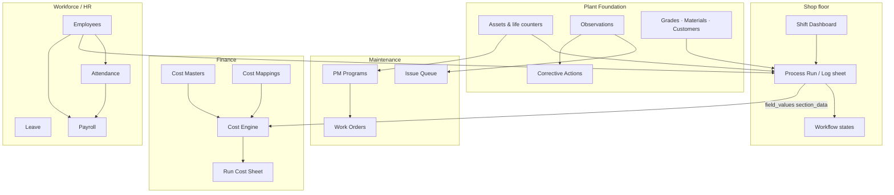

# MOI Platform — User Guide & Module Connections

How the Chandan Steel demo fits together: what each area does, how data flows between modules, and example workflows you can run end-to-end.

**Related docs:** [LOGINS.md](../LOGINS.md) (credentials & URLs) · [MANUFACTURING_HIERARCHY.md](MANUFACTURING_HIERARCHY.md) (departments & log sheets) · [README.md](../README.md) (setup)

---

## 1. Big picture

The platform is built around a single chain:

```
Organisation → Plant → Department → Process → Asset/Line → Process Run (log sheet)
                              ↓
                    Workforce · Maintenance · Finance · Foundation
```

| Layer | What it is | Examples |
|-------|------------|----------|
| **Shop floor** | Digital logbooks & live runs | IAF heat, rolling mill shift, wire coil trace |
| **Plant Foundation** | Master data & quality loop | Assets, grades, materials, observations, corrective actions |
| **Maintenance** | Breakdown issues + preventive PM | Issue queue, PM programs, work orders |
| **Finance** | Cost from operational data | Rates, mappings, per-run cost sheets |
| **Workforce (HR)** | People, time, pay | Employees, attendance, leave, payroll, skills |

Nothing “magically” syncs unless the **connection is designed**:

- **Process runs** store field values and section data → **Finance** reads them via **cost mapping rules**.
- **Observations** on the shop floor → **Maintenance issue queue** (by category).
- **Assets** carry life counters (`heat_count`, `runtime_hours`) → **PM triggers** fire → **work orders**.
- **Shift assignments** define who works which shift → **Attendance** marks presence.
- **Employees** can be bulk-imported → same user records used for log sheet sign-offs and payroll.

---

## 2. Connection map



---

## 3. Shop floor (operations logbooks)

### Where to go

| Screen | URL | Who |
|--------|-----|-----|
| Shift dashboard | `/shift` | Worker, supervisor |
| Heat / run workspace | `/heat/:runId` | Anyone filling a run |
| My runs | `/my-runs` | Worker, supervisor |
| Supervisor monitor | `/supervisor` | Supervisor |
| Run report (read-only) | `/reports/:runId` | HoD, CEO, etc. |

### How a run is created

1. User opens **Shift Dashboard** → picks process (e.g. IAF) → furnace instance → shift → **Start run**.
2. System creates a **process run** locked to a **published template version** (e.g. F/PRD/02).
3. User fills **tabs (sections)** and clicks **Save** on each tab.
4. **Workflow actions** (IAF) appear only on the tab where that step belongs — they change heat **status**, not form data.

### IAF example (F/PRD/02) — guided workflow

| Step | Tab | Action | Saves what |
|------|-----|--------|------------|
| 1 | Heat Information | **Start Heat** | Opens run (`created` → `in_progress`) |
| 2 | Timing & Equipment | **Power On** | Lifecycle only; stamp `power_on_time` here |
| 3 | Charge Mix | (fill + Save) | Scrap/material kg → used by **Finance** |
| 4 | Chemical Composition | **Record Sample** | Chemistry rows |
| 5 | Ferro Alloy Additions | **Ready To Tap** | Alloy additions |
| 6 | Timing & Equipment | **Tap Completed** | `tapping_time`, power readings |
| 7 | Remarks & Sign-off | **Approve** → **Close** | Supervisor sign-off |

**Important:** Workflow buttons do **not** save the form. Always **Save** each section before advancing.

### What a completed run feeds

| Consumer | What it reads |
|----------|----------------|
| **Finance** | `charge_mix`, `ferro_alloys`, `power_total`, etc. via mappings |
| **Reports** | Full read-only log sheet |
| **Analytics / KPIs** | Tap-to-tap, throughput (backend facts) |
| **Asset counters** | Heat completion can increment `heat_count` on linked asset (PM) |

---

## 4. Plant Foundation

### Screens

| Screen | URL | Typical roles |
|--------|-----|----------------|
| Assets | `/foundation/assets` | HoD, platform admin, CEO |
| Masters | `/foundation/masters` | HoD, platform admin |
| Observations | `/foundation/observations` | Supervisor, maintenance |
| Corrective actions | `/foundation/corrective-actions` | Supervisor, maintenance |
| Documents | `/foundation/documents` | All (read) |
| Analytics | `/foundation/analytics` | CEO, platform admin |

### What connects to what

| Foundation entity | Used by |
|-------------------|---------|
| **Assets** (furnaces, lines) | Process instances, PM programs, cost by asset, maintenance history |
| **Steel grades & chemistry specs** | IAF/AOD chemistry tables |
| **Material catalog** (scrap, alloys) | Charge mix, ferro alloys, **raw material cost rates** |
| **Customers** | Bright bar output register |
| **Coils** (wire) | WFURN → WDRAW traceability |
| **Observations** | Can raise **maintenance issues**; link to **corrective actions** |
| **Delay codes** (rolling mill) | Delay register → delay events → observations |

### Example: observation → maintenance

1. Supervisor logs an **Observation** (equipment / safety / quality category).
2. From supervisor monitor or maintenance flow, raise a **Maintenance Issue**.
3. Category-scoped maintenance user sees it in **Issue Queue** (`/maintenance`).
4. Assign → work → close (audit trail kept).

---

## 5. Maintenance

Two parallel tracks: **reactive** (issues) and **preventive** (PM).

### Screens

| Screen | URL | Roles |
|--------|-----|-------|
| Dashboard | `/maintenance/dashboard` | Maintenance manager, HoD, CEO |
| PM Programs | `/maintenance/programs` | Maintenance manager, CEO, plant admin |
| Work Orders | `/maintenance/work-orders` | PM viewers + maintenance |
| Work order detail | `/maintenance/work-orders/:id` | Same |
| Issue Queue | `/maintenance` | Maintenance (by category) |

### Reactive: issue queue

```
Observation / shop floor event
        ↓
Maintenance Issue (category: quality, safety, equipment, …)
        ↓
Assign → In progress → Closed
```

- Scoped by **department** and **observation category** per maintenance user seed.
- Separate from PM work orders.

### Preventive: PM program → work order

```
PM Program (Active)
  ├── Triggers (time / heat count / runtime hours / manual)
  ├── Task templates (checklist)
  ├── Notification rules (optional)
  └── Auto-generate work orders (on/off)
        ↓
PM Evaluate (dashboard or lifespan hook)
        ↓
Work Order (starts as Draft)
        ↓
Assign → Accept → In progress → Complete → Verify → Close
```

### Trigger types

| Type | You configure | Fires when |
|------|---------------|------------|
| **Calendar time** | Repeat every N **days** | Interval elapsed |
| **Heat count** | Every N **heats** | Asset `heat_count` counter crosses threshold |
| **Runtime hours** | Every N hours | Asset `runtime_hours` counter |
| **Manual** | — | Only when PM evaluate is run manually |

**Heat-count PM** requires the program linked to an **asset** whose life counter increments (e.g. when heats complete).

### Work order lifecycle

```
Draft → Assigned → Accepted → In progress → Completed → Verified → Closed
```

New WOs are **Draft** on purpose — a planner assigns before work starts.

### Example PM workflow (furnace lining every 50 heats)

1. **Maintenance manager** → PM Programs → Create program.
2. Step **Triggers** → type **Heat count** → “Every N heats” = `50` → **+ Add trigger**.
3. Step **Tasks** → add inspection checklist items → **+ Add task**.
4. **Finish** → program becomes **Active**.
5. Link program to **IAF #1** asset (asset_id on program).
6. Complete 50 IAF heats (counter increases).
7. Run **PM Evaluate** on maintenance dashboard.
8. **Work order** appears (Draft) → **Assign** → **Accept & start** → complete tasks → **Close**.

---

## 6. Finance

Finance is **downstream of operations**: it does not replace log sheets.

### Screens

| Screen | URL | Who can view / edit |
|--------|-----|---------------------|
| Cost dashboard | `/finance/dashboard` | CEO, HoD, supervisor |
| Cost masters | `/finance/masters` | CEO, plant admin |
| Cost mapping builder | `/finance/mappings` | CEO, plant admin, HoD |
| Calculations | `/finance/calculations` | CEO, plant admin |
| Cost analytics | `/finance/analytics` | CEO, HoD, supervisor |
| Per-run cost sheet | `/finance/runs/:runId/cost-sheet` | From dashboard drill-down |

### How costing works

```
Cost Masters (₹/kg, ₹/kWh, labour, maintenance defaults)
        +
Cost Mapping Rules (template field/section → cost category)
        +
Process Run (saved field_values + section_data)
        ↓
Cost Engine (on Tap Complete / Approve / Close, or manual Calculate)
        ↓
Cost Calculation + line items + warnings
```

### IAF mappings (seeded for F/PRD/02)

| Source | Category |
|--------|----------|
| `power_total` (calculated field) | Power |
| `charge_mix` rows (material + kg) | Raw material |
| `ferro_alloys` rows | Raw material |

### Example: IAF heat → cost sheet

1. Melter completes heat and **saves** Charge Mix + Ferro Alloys + power readings.
2. Workflow → **Tap Completed** → **Approve** → **Close**.
3. CEO or supervisor → **Finance** → find run → **Cost sheet**.
4. If ₹0 raw material: check warnings, confirm sections were **saved**, click **Calculate Cost** again.
5. Drill **Cost dashboard** by department → process → asset.

### Finance ↔ other modules

| Module | Link |
|--------|------|
| Operations | Source data (runs) |
| Foundation | Material catalog codes, assets |
| Maintenance | Maintenance cost rates; issues can feed maintenance line items |
| Workforce | Labour rates (for labour category mappings) |

---

## 7. Workforce / HR

### Screens

| Screen | URL | Roles |
|--------|-----|-------|
| Workforce dashboard | `/workforce/dashboard` | HR, CEO, HoD, supervisor |
| Employees | `/workforce/employees` | HR, admin (+ import) |
| Contractors | `/workforce/contractors` | HR |
| Shift assignments | `/workforce/shift-assignments` | HR |
| Shift planning | `/workforce/shift-planning` | HR |
| Attendance | `/workforce/attendance` | HR |
| Shift handover | `/workforce/handover` | HR (view), supervisor (write) |
| Leave requests | `/workforce/leave` | HR |
| Skill matrix | `/workforce/skills` | HR |
| Training | `/workforce/training` | HR |
| Payroll | `/workforce/payroll` | HR |
| My attendance / leave / payslips | `/workforce/my-*` | Worker |

### How HR connects

```
Employees (users + employee records)
    ├── Shift assignments → who is on A/B/C shift
    ├── Attendance → present/absent/leave per shift date
    ├── Leave requests → approval → attendance impact
    ├── Skills & training → competency records
    └── Payroll runs → salary structures → payslips

Contractors / contract workers → contractor attendance (separate from permanent staff)
```

### Example: HR day

1. **HR** imports or creates **employees** (Employees page → Import wizard).
2. **Shift assignments** — assign melters to Shift A on IAF.
3. **Shift planning** — publish weekly roster (optional).
4. After shift, **Attendance** — bulk mark present/absent for that shift + date.
5. **Supervisor** writes **shift handover** note for next shift.
6. End of month: **Payroll** → run payroll for period → workers see **My Payslips**.

### HR ↔ operations

| Link | Detail |
|------|--------|
| Melter on log sheet | `USER_REF` fields resolve to workforce users |
| Department scope | Workers/supervisors only start runs in their department |
| CEO | Org-wide workforce dashboard (all departments) |

---

## 8. End-to-end example: one day at SMS

**Actors:** IAF supervisor, melter, maintenance manager, HR, CEO.

### Morning

1. **HR** marks attendance for Shift A (`hr@chandansteel.com`).
2. **Melter** logs in → **Shift Dashboard** → starts IAF heat on **IAF #1**.
3. Melter fills **Heat Information** → Save → **Start Heat** (on that tab).
4. Enters **Charge Mix** → Save. Powers furnace → **Timing** tab → Save → **Power On**.

### Mid-shift

5. Melter records **Chemistry** sample → **Record Sample**.
6. Supervisor sees run on **Operations Activity** (`/supervisor`).
7. Operator notices vibration → **Observation** (equipment) → maintenance issue raised.

### Afternoon

8. Melter **Ready To Tap** on Ferro Alloys tab → **Tap Completed** on Timing.
9. Supervisor **Approve** → **Close** on Remarks tab.
10. **Finance** auto-calculates cost; CEO reviews **Cost dashboard**.

### Maintenance

11. **Equipment maintenance** user closes issue from **Issue Queue**.
12. **PM program** (every 50 heats) fires → **Draft WO** → manager **Assigns** → technician completes checklist.

### Next day

13. **HR** reviews handover notes and attendance anomalies.
14. **HoD** opens **Run report** for yesterday’s heat for quality review.

---

## 9. Role quick reference

| Role | Login example | Primary areas |
|------|---------------|---------------|
| Super admin | `admin@logbook.app` | Admin, all modules |
| CEO | `ceo@chandansteel.com` | Executive, finance view, workforce view, PM programs |
| HR | `hr@chandansteel.com` | Workforce ops, import |
| HoD | `hod@chandansteel.com` | Department overview, foundation assets, finance view |
| IAF supervisor | `iaf.supervisor@chandansteel.com` | Shift floor, supervisor monitor, finance view |
| Melter | `melter@chandansteel.com` | Shift dashboard, heat workspace |
| Maintenance | `maint.equipment@chandansteel.com` | Issue queue (equipment category) |

Full table: [LOGINS.md](../LOGINS.md).

---

## 10. Common mistakes

| Symptom | Likely cause | Fix |
|---------|--------------|-----|
| Raw material cost ₹0 | Charge mix not **saved**, or no rate for material code | Save section; check Finance → Cost masters |
| Workflow button does nothing useful | Clicked without saving tab | Save section first |
| PM never creates work orders | Program still **draft**, or trigger type wrong | Finish wizard (Active); use heat **threshold** not days |
| WO stuck in Draft | By design | **Assign** from Work Orders |
| Payroll empty | No **salary structures** seeded / no employees | HR → Payroll; seed or create structures |
| Edit PM white screen | Was a frontend crash on load | Fixed — refresh; should show “Loading PM program…” |
| Can't see Finance | Role not in finance view list | Use CEO, HoD, or supervisor account |

---

## 11. API & extension points

- Swagger: `http://localhost:8000/docs`
- WebSocket: live run events `/ws/process-runs/{id}`
- Import engine: `POST /api/v1/imports/*` (employees module on Workforce page)
- PM evaluate: `POST /api/v1/maintenance/pm/evaluate`
- Cost compute: triggered on run terminal states + manual endpoint from Finance UI

For architecture detail see [ARCHITECTURE.md](../ARCHITECTURE.md).

---

## 12. Plant Pulse (Phase 5)

Operational dashboards consume existing runs, assets, maintenance, finance, and workforce data without replacing CRUD workflows.

| Screen | Who | Route |
|--------|-----|-------|
| **Plant Pulse** | CEO | `/pulse/plant` |
| **Department Pulse** | HoD / CEO | `/pulse/department` |
| **Asset Workspace** | All (QR scan) | `/assets/{id}/workspace` |
| **Energy** | Leadership | `/energy` |
| **Safety** | Supervisors, maintenance | `/safety/dashboard` |
| **Inventory Pulse** | CEO | `/inventory-pulse` |

**Demo flow:** CEO login → Plant Pulse shows OEE, production, department cards, live feed, and alerts. Scan QR (`/safety/scan`) or open any asset workspace for live parameters, health, maintenance, and OEE.

See [PHASE5_PULSE.md](PHASE5_PULSE.md) for API endpoints and refresh behaviour.
